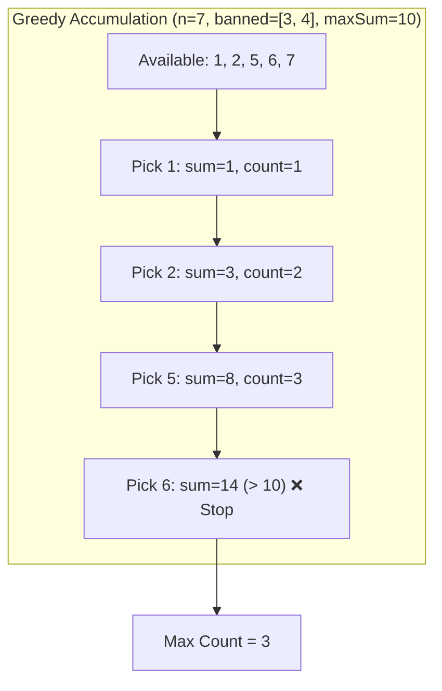

## 2554. Maximum Number of Integers to Choose From a Range I
LeetCode Link: https://leetcode.com/problems/maximum-number-of-integers-to-choose-from-a-range-i/

## The Problem
You are given an integer array `banned` and two integers `n` and `maxSum`. You are choosing some number of integers following these rules:
- The chosen integers must be in the range `[1, n]`.
- Each integer can be chosen at most once.
- The chosen integers must not be in the array `banned`.
- The sum of the chosen integers must not exceed `maxSum`.

Return the maximum number of integers you can choose.

## Architecture: The "Greedy Prefix" Realization

It is tempting to view this as a "Max Length Subarray Sum <= K" problem and apply a Sliding Window. However, Sliding Window evaluates combinations starting from *any* index. 

Since our goal is to maximize the **count** of numbers, and all numbers are strictly positive and increasing (`1` to `n`), we have a pure **Greedy Choice Property**. We must always pick the smallest available numbers first. We simply iterate from `1` to `n`, skip banned numbers using a Hash Set, and accumulate the sum until we hit the ceiling.



## Approaches

| Approach | Time Complexity | Space Complexity | Why it fails/succeeds |
| :--- | :--- | :--- | :--- |
| **Backtracking (Combinations)** | $O(2^N)$ | $O(N)$ | Trying every possible valid combination of numbers is exponential and will immediately Time Limit Exceed (TLE). |
| **Filtered Array + Sliding Window** | $O(N)$ | $O(N)$ | Filters banned elements into a new array, then uses two pointers. It works, but wastes memory creating a new array and wastes time evaluating sliding windows that are mathematically inferior to the prefix. |
| **Hash Set + Greedy (Optimal)** | **$O(N + B)$** | **$O(B)$** | Inserts banned elements into a set ($B$ is size of `banned`). Iterates $1$ to $N$, taking the smallest numbers until `maxSum` is breached. Pure, optimal execution. |

## C++ Code: Hash Set + Greedy

```cpp
#include <vector>
#include <unordered_set>

using namespace std;

class Solution {
public:
    int maxCount(vector<int>& banned, int n, int maxSum) {
        // 1. Create a set for O(1) lookups of banned numbers
        unordered_set<int> bannedSet(banned.begin(), banned.end());
        
        long long sum = 0; 
        int count = 0;     

        // 2. Greedily pick the smallest numbers first
        for (int i = 1; i <= n; i++) {
            if (bannedSet.count(i)) continue; 
            
            sum += i; 
            if (sum > maxSum) break; // Early exit once budget is blown
            
            count++; 
        }

        return count; 
    }
};
```

## Complexity Analysis
- **Time Complexity:** $O(N + B)$. It takes $O(B)$ time to populate the `unordered_set` with the banned elements, and at most $O(N)$ time to iterate through the numbers from $1$ to $n$.
- **Space Complexity:** $O(B)$ to store the unique banned elements in the hash set.

## Real-World Use Case
### Cloud Resource Budget Allocation
This greedy algorithm perfectly maps to automated cloud resource provisioning under a strict financial budget. If a system needs to spin up as many micro-instances as possible to handle parallel background tasks (maximizing instance count), but certain instance IDs are currently degraded/unavailable (`banned`), the orchestrator will greedily allocate the cheapest available instances (`1` to `n` ordered by price) until the hourly financial `maxSum` budget is exhausted.
