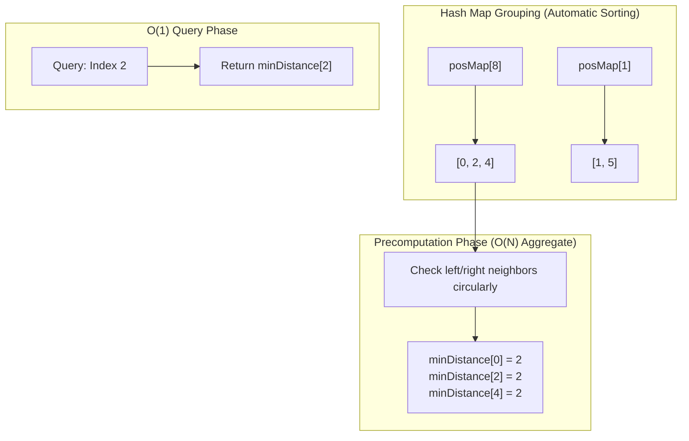

## 3488. Closest Equal Element Queries
LeetCode Link: https://leetcode.com/problems/closest-equal-element-queries/

## The Problem
Given an array `nums` of size $N$ and an array of `queries`, where each query provides an index $q$, find the minimum circular distance from $q$ to another index $i$ such that `nums[q] == nums[i]`. If no such element exists, return `-1`.

## Architecture: Grouped Indices + $O(N)$ Precomputation

To answer a large number of queries efficiently, we must detach the query execution time from the size of the array. Iterating through the array or searching for the closest matching element for every query will result in $O(Q 	imes N)$ or $O(Q \log N)$ complexity.

Instead, we precompute the shortest circular distance for *every* element in a single pass.
1. **The Hash Map Index:** A `std::unordered_map<int, vector<int>>` groups identical elements by their original indices. Because we iterate from left to right, the index vectors are inherently sorted.
2. **Circular Neighbor Resolution:** In a sorted array of mapped indices, the closest element is *always* the immediate left or right neighbor. We calculate this for every index, using modulo arithmetic to handle the circular wrap-around seamlessly.



## Approaches

| Approach | Precomputation Time | Query Time | Why it fails/succeeds |
| :--- | :--- | :--- | :--- |
| **Brute Force Linear Scan** | None | $O(N)$ | Searching the entire array for every query causes a Time Limit Exceeded (TLE) error ($O(Q 	imes N)$ total). |
| **Hash Map + Binary Search** | $O(N)$ | $O(\log N)$ | Fast, but finding the target via `std::lower_bound` on the mapped vector takes logarithmic time ($O(N + Q \log N)$ total). |
| **Hash Map + Precomputation (Optimal)** | **$O(N)$** | **Strict $O(1)$** | The most performant. We calculate the answer for every index upfront. Since the total size of all mapped vectors equals $N$, the precomputation loop is strictly $O(N)$. |

## C++ Code: Hash Map + Precomputation

```cpp
#include <vector>
#include <unordered_map>
#include <algorithm>
#include <cmath>

using namespace std;

class Solution {
public:
    vector<int> solveQueries(vector<int>& nums, vector<int>& queries) {
        int n = nums.size();
        unordered_map<int, vector<int>> posMap;

        // 1. Build the index map (Automatically sorted)
        for (int i = 0; i < n; ++i) {
            posMap[nums[i]].push_back(i);
        }

        // 2. Precompute the answers for every index in O(N) aggregate time
        vector<int> minDistance(n, -1);

        for (const auto& [val, pos] : posMap) {
            int k = pos.size();
            
            // If there are no other equal elements, it remains -1
            if (k <= 1) continue;

            for (int i = 0; i < k; ++i) {
                int current_idx = pos[i];
                
                // The closest elements are ALWAYS the immediate neighbors.
                // We use modulo arithmetic to seamlessly handle the circular wrap-around.
                int left_neighbor_idx = pos[(i - 1 + k) % k];
                int right_neighbor_idx = pos[(i + 1) % k];

                // Helper lambda for clean circular distance calculation
                auto getDist = [&](int a, int b) {
                    int dist = abs(a - b);
                    return min(dist, n - dist);
                };

                minDistance[current_idx] = min(
                    getDist(current_idx, left_neighbor_idx), 
                    getDist(current_idx, right_neighbor_idx)
                );
            }
        }

        // 3. Answer all queries in pure O(1) time
        vector<int> result;
        result.reserve(queries.size()); 
        
        for (int q : queries) {
            result.push_back(minDistance[q]); 
        }

        return result;
    }
};
```

### Complexity Analysis
* **Time Complexity:** $O(N + Q)$. We visit every element in `nums` exactly once during the precomputation phase ($O(N)$), and then answer each query instantly in $O(1)$ contiguous memory lookup ($O(Q)$).
* **Space Complexity:** $O(N)$ to store the `posMap` and the precomputed `minDistance` array.

## Real-World Use Case
### Consistent Hashing & Ring Topologies
This mathematical logic perfectly mirrors Consistent Hashing in distributed databases. In a cloud-backed architecture, servers are placed on a circular token ring. When a routing layer needs to instantly find the "closest" available replica node on the ring to sync state, it relies on a precomputed routing table. This allows load balancers to route millions of incoming requests in pure $O(1)$ time without traversing the ring per request.
