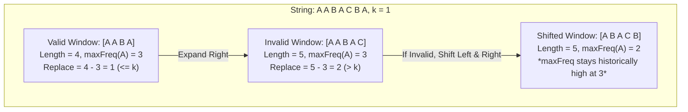

## 424. Longest Repeating Character Replacement
LeetCode Link: https://leetcode.com/problems/longest-repeating-character-replacement/

## The Problem
Given a string `s` and an integer `k`, you can choose any character of the string and change it to any other uppercase English character. You can perform this operation at most `k` times. Return the length of the longest substring containing the same letter you can get after performing the above operations.

## Architecture: The "Historical Max" Sliding Window

The core logic to check if a window is valid is:
`Elements to Replace = (Window Length) - (Frequency of Most Common Character)`
If `Elements to Replace <= k`, the window is valid.

The trap is that if we shrink the window from the left, we might remove the "Most Common Character", forcing us to rescan the entire frequency map to find the new max frequency, ruining our $O(N)$ time complexity. 

Instead, we use the **Historical Max Trick**. We never decrement `maxFreq`. If a window becomes invalid, we do not shrink it (using a `while` loop). Instead, we just *shift* it (using an `if` statement). The window size remains locked at its maximum discovered length and simply slides across the array until it finds a sequence that allows it to grow again.


## Approach
1. Strict Sliding Window $O(26 \cdot N)$ time and space of $O(1)$
   - Uses a while loop to shrink. Requires scanning the 26-character array on every shrink step to find the new true maxFreq. Unnecessary overhead.
2. Historical Max Sliding Window (Optimal) $O(N)$ time and space of $O(1)$
   - Uses an if statement to shift the window. maxFreq is never decremented, acting as a high-water mark. Pure $O(N)$ execution.
## Code

```
#include <string>
#include <vector>
#include <algorithm>

using namespace std;

class Solution {
public:
    int characterReplacement(string s, int k) {
        vector<int> count(26, 0); // O(1) contiguous memory lookup
        int left = 0;
        int maxFreq = 0;
        int maxLength = 0;

        for (int right = 0; right < s.length(); ++right) {
            // 1. Update frequency map for the incoming character
            count[s[right] - 'A']++;
            
            // 2. Update the historical maximum frequency
            maxFreq = max(maxFreq, count[s[right] - 'A']);

            // 3. If invalid, SHIFT the window (don't shrink it)
            if ((right - left + 1) - maxFreq > k) {
                count[s[left] - 'A']--;
                left++; 
            }

            // 4. Record the max length
            maxLength = max(maxLength, right - left + 1);
        }

        return maxLength;
    }
};
```
## Complexity Analysis
- Time Complexity: $O(N)$. We iterate through the string exactly once. Lookups and updates in the size-26 vector take $O(1)$ time.
- Space Complexity: $O(1)$. The character frequency map is fixed at 26 elements regardless of the input string size.

## Real-World Use Case
#### Genomic Sequence Error Tolerance

This algorithm is directly applicable in bioinformatics for analyzing DNA sequences. When scanning a massive genomic sequence string for the longest contiguous block of a specific base pair trait, natural mutations or sequencing machine noise introduce "garbage" characters. If the analytical model permits a noise tolerance of k errors, this sliding window efficiently isolates the longest statistically significant genetic sequence in a single pass without reprocessing massive strings.
