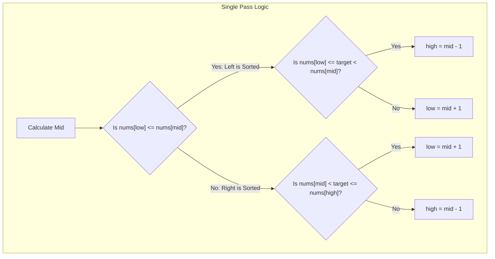

## Search in Rotated Sorted Array (All Variations)
LeetCode Links: 
- [33. Search in Rotated Sorted Array (Unique Elements)](https://leetcode.com/problems/search-in-rotated-sorted-array/)
- [81. Search in Rotated Sorted Array II (With Duplicates)](https://leetcode.com/problems/search-in-rotated-sorted-array-ii/)

## The Problem
There is an integer array `nums` sorted in ascending order. Prior to being passed to your function, `nums` is possibly rotated at an unknown pivot index. 
Given the array `nums` after the possible rotation and an integer `target`, return the index of `target` if it is in `nums`, or `-1` if it is not in `nums`.
*Variation II:* The array may contain duplicates. Return `true` if `target` is in `nums`, or `false` otherwise.

## Architecture: The "Sorted Half" Paradigm

Whether the array is left-rotated or right-rotated, splitting it at any index `mid` guarantees that **at least one half of the array is strictly strictly increasing (sorted).**

Instead of finding the pivot point, we simply:
1. Identify which half is sorted by comparing `nums[low]` to `nums[mid]`.
2. Check if the `target` falls within the numeric range of that sorted half.
3. If it does, we discard the other half. If it doesn't, we discard the sorted half and search the chaotic half.

### Handling The Edge Case: Duplicates (The L5 Differentiator)
If the array has duplicates, you can hit a state where `nums[low] == nums[mid] == nums[high]`. 
*(e.g., `[3, 1, 2, 3, 3, 3, 3]` with `low = 0`, `mid = 3`, `high = 6`)*
In this state, you cannot mathematically determine which half is sorted. The only safe operation is to shrink the search space by moving both pointers inward (`low++` and `high--`) until the bounds differ, effectively degrading to $O(N)$ in the absolute worst-case scenario.



## Approaches

| Approach | Time Complexity | Space Complexity | Why it fails/succeeds |
| :--- | :--- | :--- | :--- |
| **Linear Search** | $O(N)$ | $O(1)$ | Fails the fundamental requirement of utilizing the sorted property. |
| **Find Pivot + 2x Binary Search** | $O(\log N)$ | $O(1)$ | Works, but requires writing two separate binary search functions and edge-case handling for arrays that aren't rotated at all. Clunky architecture. |
| **Single-Pass Binary Search (Optimal)** | **$O(\log N)$** | **$O(1)$** | Cleanest state management. Elegantly handles all rotations (left or right) and fully sorted arrays with identical logic. |
| **Single-Pass (With Duplicates)** | **$O(\log N)$ avg / $O(N)$ worst** | **$O(1)$** | Required when `nums[low] == nums[mid] == nums[high]`. Shrinks bounds until a sorted half can be identified. |

## C++ Code: Single-Pass Binary Search (Handles All Cases)

```cpp
#include <vector>

using namespace std;

class Solution {
public:
    // This implementation solves the hardest variation (Duplicates allowed).
    // If you need to return the index (Unique elements only), simply change the return 
    // type to int, return `mid` when found, and remove the "Duplicate Pruning" block.
    bool search(vector<int>& nums, int target) {
        int low = 0;
        int high = nums.size() - 1;

        while (low <= high) {
            int mid = low + (high - low) / 2;

            if (nums[mid] == target) return true;

            //Edge Case: Duplicate Pruning
            // If we can't determine which half is sorted, shrink the bounds.
            if (nums[low] == nums[mid] && nums[mid] == nums[high]) {
                low++;
                high--;
                continue;
            }

            // Condition 1: Left half is perfectly sorted
            if (nums[low] <= nums[mid]) {
                // Is the target strictly within this sorted left boundary?
                if (nums[low] <= target && target < nums[mid]) {
                    high = mid - 1; // Discard right half
                } else {
                    low = mid + 1;  // Discard left half
                }
            } 
            // Condition 2: Right half is perfectly sorted
            else {
                // Is the target strictly within this sorted right boundary?
                if (nums[mid] < target && target <= nums[high]) {
                    low = mid + 1;  // Discard left half
                } else {
                    high = mid - 1; // Discard right half
                }
            }
        }

        return false;
    }
};
```

## Real-World Use Case
### Database Shard Hashing Rings
Consistent hashing is heavily used in distributed databases (like Amazon DynamoDB). The hash ring is essentially a massive sorted array of node IDs that wraps around in a circle. If you need to route a request to the correct node based on a partition key, finding the immediate next available node on this circular "rotated" array is effectively a variation of this exact binary search algorithm, executed millions of times per second.
