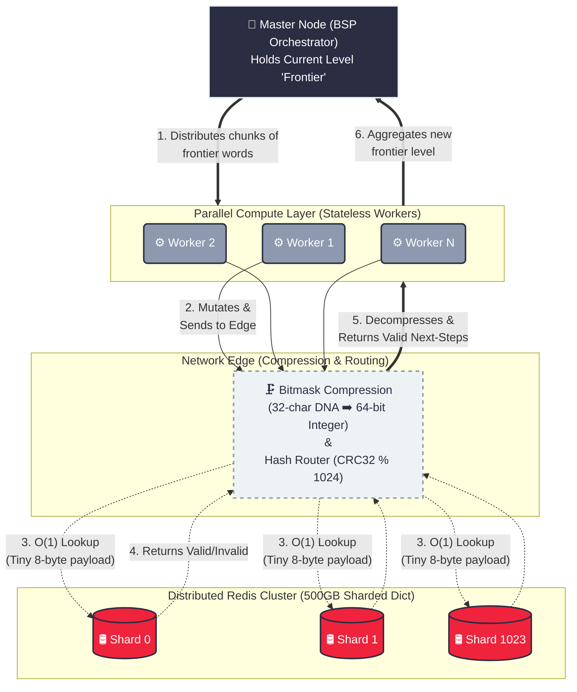

# 127. Word Ladder
https://leetcode.com/problems/word-ladder/

## The Problem
Given two words, `beginWord` and `endWord`, and a dictionary `wordList`, return the number of words in the shortest transformation sequence from `beginWord` to `endWord`. 
* Every adjacent pair of words must differ by exactly one letter.
* Every intermediate word must exist in the `wordList`.

##  The Architecture (Graph Traversal Bottlenecks)
Word Ladder is the ultimate test of managing the **Branching Factor** ($B$) in a graph. If a word has 10 characters, each step generates up to 250 possible mutations. 
In a standard BFS, the search space explodes exponentially: $O(B^d)$ where $d$ is the depth.
* Level 1: 1 word
* Level 2: 250 words
* Level 3: 62,500 words...

To solve this efficiently, we must optimize both memory allocation at the micro-level, and the search space at the macro-level.

---

##  Implementation 1: Optimized Standard BFS
This implementation handles memory safely by modifying the string **in-place** and backtracking, entirely avoiding the heavy CPU cost of allocating new strings on the heap for every mutation.

```cpp
class Solution {
public:
    int ladderLength(string beginWord, string endWord, vector<string>& wordList) {
        unordered_set<string> dict(wordList.begin(), wordList.end());
        if (dict.count(endWord) == 0) return 0;

        queue<pair<string, int>> q;
        q.push({beginWord, 1});

        while (!q.empty()) {
            auto [currWord, steps] = q.front();
            q.pop();

            if (currWord == endWord) return steps;

            // In-place modification avoids massive heap allocations
            for (int idx = 0; idx < currWord.size(); ++idx) {
                char currChar = currWord[idx];

                for (char ch = 'a'; ch <= 'z'; ++ch) {
                    currWord[idx] = ch;

                    if (dict.count(currWord) > 0) {
                        q.push({currWord, steps + 1});
                        dict.erase(currWord); // Erase immediately to prevent cycles
                    }
                }
                currWord[idx] = currChar; // Backtrack
            }
        }
        return 0;
    }
};
```
## Implementation 2: Bidirectional BFS to prevent the queue from exploding
we search forward from beginWord AND backward from endWord simultaneously.When the two frontiers intersect, we have found the shortest path. We dynamically swap the sets to 
always expand the smaller of the two frontiers. This mathematically cuts the search space from $O(B^d)$ to $O(B^{d/2} + B^{d/2})$, yielding a massive performance boost.

```cpp
class Solution {
public:
    int ladderLength(string beginWord, string endWord, vector<string>& wordList) {
        unordered_set<string> dict(wordList.begin(), wordList.end());
        if (dict.find(endWord) == dict.end()) return 0;

        unordered_set<string> beginSet, endSet;
        beginSet.insert(beginWord);
        endSet.insert(endWord);
        
        int step = 1;

        while (!beginSet.empty() && !endSet.empty()) {
            // Always expand the smaller frontier to minimize branching
            if (beginSet.size() > endSet.size()) swap(beginSet, endSet);

            unordered_set<string> nextSet;
            for (string word : beginSet) {
                for (int i = 0; i < word.size(); i++) {
                    char originalChar = word[i];
                    for (char c = 'a'; c <= 'z'; c++) {
                        word[i] = c;
                        if (endSet.find(word) != endSet.end()) return step + 1; // Intersection!
                        
                        if (dict.find(word) != dict.end()) {
                            nextSet.insert(word);
                            dict.erase(word);
                        }
                    }
                    word[i] = originalChar;
                }
            }
            beginSet = nextSet;
            step++;
        }
        return 0;
    }
};
```

## System Design & Scaling Context
What if the word dictionary is 500GB of DNA sequences, and a single machine cannot hold the unordered_set in RAM?

1. Data Partitioning (Sharding): The dictionary cannot fit on one machine. We partition the dictionary across a distributed cache cluster (like Redis/Memcached) using a Hash function.
   To validate a mutation, we hash the string and query the specific shard.
2. Distributed BFS (Pregel / Apache Giraph): A single while loop won't scale. We adopt a Bulk Synchronous Parallel (BSP) model. A Master node holds the current frontier, chunks it, and delegates the mutation/validation work to hundreds of Worker nodes. The workers return valid next-step sequences to the Master to build the next frontier level.
3. Memory Compression: Storing genetic sequences as raw strings wastes network bandwidth. Since DNA is only 4 characters (A, C, G, T), each character can be encoded as 2 bits. A 32-character sequence perfectly packs into a single 64-bit integer, reducing payload size by ~80%.


