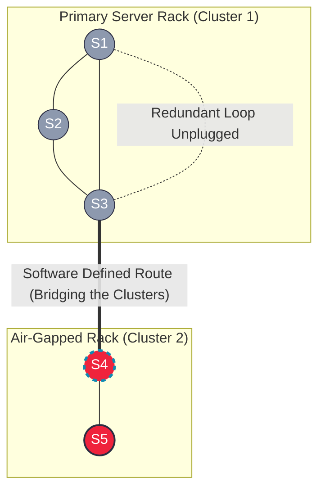

# 1319. Number of Operations to Make Network Connected
https://leetcode.com/problems/number-of-operations-to-make-network-connected/

## The Problem
You are given an initial computer network with `n` computers and a list of `connections` (ethernet cables). You can extract any given cable between two directly connected computers and place it between any pair of disconnected computers. Return the minimum number of times you need to do this to connect all the computers. If it's not possible, return `-1`.

---

##  The Architecture: DSU (Cluster Management)
This is a resource allocation and cluster fragmentation problem. 
To physically connect $N$ computers into a single network, you need an absolute mathematical minimum of $N - 1$ cables. If you have fewer cables than that, it is physically impossible.

If you *do* have enough cables, the problem reduces to:
1. Identifying how many **isolated clusters** exist.
2. Identifying how many **redundant cables** (cycles inside a cluster) are free to be unplugged.

By using a **Disjoint Set Union (DSU)** data structure, we can start with $N$ isolated components. Every time we successfully `unite()` two computers, we decrement our isolated component count. Every time `unite()` fails (meaning the computers were already connected), we increment our inventory of "free/redundant cables."

The required operations will simply be the final number of isolated clusters minus 1.

---

##  The Production Code (C++)
```cpp
class DSU {
private:
    vector<int> parent, rank;
    int components;
public:
    DSU(int n) {
        parent.resize(n);
        rank.resize(n, 0);
        components = n; // Start with N isolated islands
        for (int i = 0; i < n; i++) parent[i] = i;
    }

    int find(int x) {
        if (parent[x] == x) return x;
        return parent[x] = find(parent[x]);
    }

    bool unite(int x, int y) {
        int rootX = find(x);
        int rootY = find(y);
        
        if (rootX == rootY) return false; // Cycle! Cable is redundant.

        if (rank[rootX] < rank[rootY]) parent[rootX] = rootY;
        else if (rank[rootX] > rank[rootY]) parent[rootY] = rootX;
        else {
            parent[rootY] = rootX;
            rank[rootX]++;
        }
        components--; // Two clusters merged into one
        return true;
    }
    
    int getComponents() { return components; }
};

class Solution {
public:
    int makeConnected(int n, vector<vector<int>>& connections) {
        // Physical impossibility check
        if (connections.size() < n - 1) return -1;
        
        DSU dsu(n);
        int redundantCables = 0;
        
        for (const auto& conn : connections) {
            if (!dsu.unite(conn[0], conn[1])) {
                redundantCables++;
            }
        }
        
        int isolatedClusters = dsu.getComponents();
        int cablesNeeded = isolatedClusters - 1;
        
        return redundantCables >= cablesNeeded ? cablesNeeded : -1;
    }
};
```

## Complexity Analysis
- Time Complexity: $O(E \times \alpha(V))$ — We process each connection once using the near-$O(1)$ DSU operations.
- Space Complexity: $O(V)$ — For the DSU tracking arrays. We do not need an $O(V+E)$ Adjacency List.

## System Design Context: Network Partitions (Split-Brain)

This algorithm models how massive distributed systems handle Network Partitions (The 'P' in the CAP Theorem).

1. Kubernetes & Cassandra (Cluster Healing)

  In a 10,000-node server cluster, a faulty top-of-rack switch can instantly sever the network, creating two isolated "islands" of servers that cannot talk to each other. This is called a Split-Brain scenario.
The master control plane (using a protocol like Raft or Paxos) must constantly monitor cluster connectivity. DSU allows the control plane to rapidly determine exactly how many isolated clusters exist, and automatically route commands to secondary network interfaces (simulating moving a cable) to bridge the air-gapped clusters back into a single unified system.


