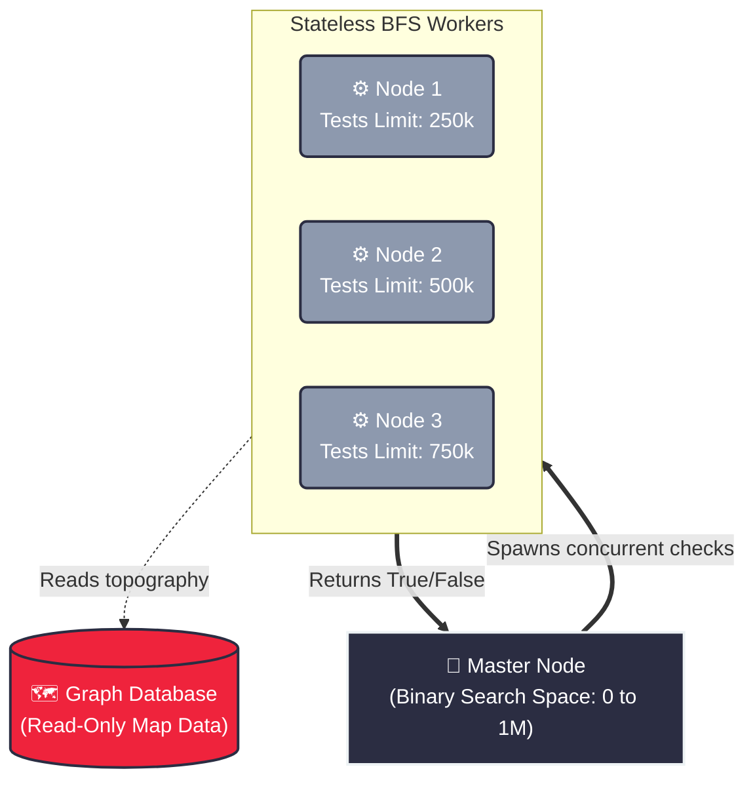

# 1631. Path With Minimum Effort
https://leetcode.com/problems/path-with-minimum-effort/description/

## The Problem
Given a 2D `heights` matrix, find a path from the top-left to the bottom-right cell. The "effort" of a path is the **maximum absolute difference** in heights between two consecutive cells on the route. Return the minimum effort required.

##  The Architecture (Bottleneck vs. Accumulation)
Unlike standard shortest-path routing (like Network Delay Time) where edge weights accumulate ($A + B + C$), this is a **Minimax Path** problem. We do not care about the sum of the journey; we only care about minimizing the single worst bottleneck: $\max(A, B, C)$.

This maps directly to real-world infrastructure:
1. **Robotics & Autonomous Vehicles:** A Mars Rover navigating topography must avoid paths where a single steep incline exceeds its motor capacity, regardless of the path's total length.
2. **Network Bandwidth Routing:** Finding a route for a 4K video stream where the weakest link (bottleneck bandwidth) is still wide enough to prevent packet dropping.

##  System Design & Distributed Scaling
There are two ways to solve this, and the choice depends on the hardware scale.

### Approach 1: Modified Dijkstra (Single-Node Optimal)
We swap the `+` for a `max()` in our relaxation step. This is optimal for a single CPU thread.
* **Time Complexity:** $O(E \log V)$
* **Limitation:** A Priority Queue enforces strict sequential processing. It is notoriously difficult to parallelize across distributed servers because the queue state must be globally synchronized.

### Approach 2: Binary Search + BFS (Distributed & Parallelizable)
We know the answer space is bounded between `0` and `1,000,000`. We can guess a maximum effort `K` and run a standard BFS that only traverses edges $\le K$. 
* **The Distributed Flex:** Because the BFS just returns a boolean (`True` if the end is reachable, `False` otherwise), we can distribute this workload. In a cloud environment, we can spin up 10 worker nodes, assign each a different `K` threshold, and run them concurrently without any shared memory locks!



## Approach 1: Modified Dijkstra (Optimal for Single CPU)
This is the fastest solution for standard LeetCode constraints.

- std::array<int, 3>: Instead of clunky nested pair<int, pair<int, int>>, we use modern C++ arrays for the Priority Queue: {effort, row, col}. It is faster and far easier to read.

- Early Exit: The absolute second we pop the destination cell (ROWS-1, COLS-1) from the Min-Heap, we return. We don't waste time processing the rest of the queue because the Min-Heap mathematically guarantees this is the lowest maximum effort.

```cpp
  #include <vector>
#include <queue>
#include <array>
#include <cmath>

using namespace std;

class Solution {
public:
    int minimumEffortPath(vector<vector<int>>& heights) {
        int rows = heights.size();
        int cols = heights[0].size();
        
        int dirs[4][2] = {{0, 1}, {1, 0}, {0, -1}, {-1, 0}};
        
        vector<vector<int>> minEffort(rows, vector<int>(cols, INT_MAX));
        minEffort[0][0] = 0;
        
        priority_queue<array<int, 3>, vector<array<int, 3>>, greater<array<int, 3>>> pq;
        pq.push({0, 0, 0});
        
        while (!pq.empty()) {
            auto [effort, r, c] = pq.top();
            pq.pop();
            
            if (r == rows - 1 && c == cols - 1) {
                return effort;
            }
            
            if (effort > minEffort[r][c]) continue;
            
            for (auto& dir : dirs) {
                int nr = r + dir[0];
                int nc = c + dir[1];
                
                if (nr >= 0 && nr < rows && nc >= 0 && nc < cols) {
                    int currentJump = abs(heights[nr][nc] - heights[r][c]);
                    int maxEffortOnPath = max(effort, currentJump);
                    
                    if (maxEffortOnPath < minEffort[nr][nc]) {
                        minEffort[nr][nc] = maxEffortOnPath;
                        pq.push({maxEffortOnPath, nr, nc});
                    }
                }
            }
        }
        return 0; 
    }
};
```

## Approach 2: Binary Search + BFS (The Distributed Flex)

If an interviewer asks you to scale this to a 500-Petabyte topographical map, Dijkstra fails because you cannot easily multithread a Priority Queue. 

This approach uses Binary Search on the Answer Space. It is $O(M \cdot N)$ per check, and we check at most $\log_2(1,000,000) \approx 20$ times. It is incredibly fast, and a Master Node could delegate each check() to a different Worker Server.

```cpp
#include <vector>
#include <queue>
#include <cmath>

using namespace std;

class Solution {
private:
    int dirs[4][2] = {{0, 1}, {1, 0}, {0, -1}, {-1, 0}};
    
    // Pure, stateless BFS. Just answers "Can we reach the end if we never jump higher than 'limit'?"
    bool canReachEnd(const vector<vector<int>>& heights, int limit) {
        int rows = heights.size();
        int cols = heights[0].size();
        
        vector<vector<bool>> visited(rows, vector<bool>(cols, false));
        queue<pair<int, int>> q;
        
        q.push({0, 0});
        visited[0][0] = true;
        
        while (!q.empty()) {
            auto [r, c] = q.front();
            q.pop();
            
            if (r == rows - 1 && c == cols - 1) return true;
            
            for (auto& dir : dirs) {
                int nr = r + dir[0];
                int nc = c + dir[1];
                
                if (nr >= 0 && nr < rows && nc >= 0 && nc < cols && !visited[nr][nc]) {
                    // Only traverse if the jump is strictly within our current test limit
                    if (abs(heights[nr][nc] - heights[r][c]) <= limit) {
                        visited[nr][nc] = true;
                        q.push({nr, nc});
                    }
                }
            }
        }
        return false;
    }

public:
    int minimumEffortPath(vector<vector<int>>& heights) {
        int left = 0;
        int right = 1000000; // Problem constraints state max height is 10^6
        int optimalEffort = right;
        
        while (left <= right) {
            int mid = left + (right - left) / 2;
            
            if (canReachEnd(heights, mid)) {
                optimalEffort = mid; // This limit works! Record it.
                right = mid - 1;     // Now, try to find an even smaller limit.
            } else {
                left = mid + 1;      // Limit was too strict, the rover got stuck. Increase it.
            }
        }
        
        return optimalEffort;
    }
};
```
