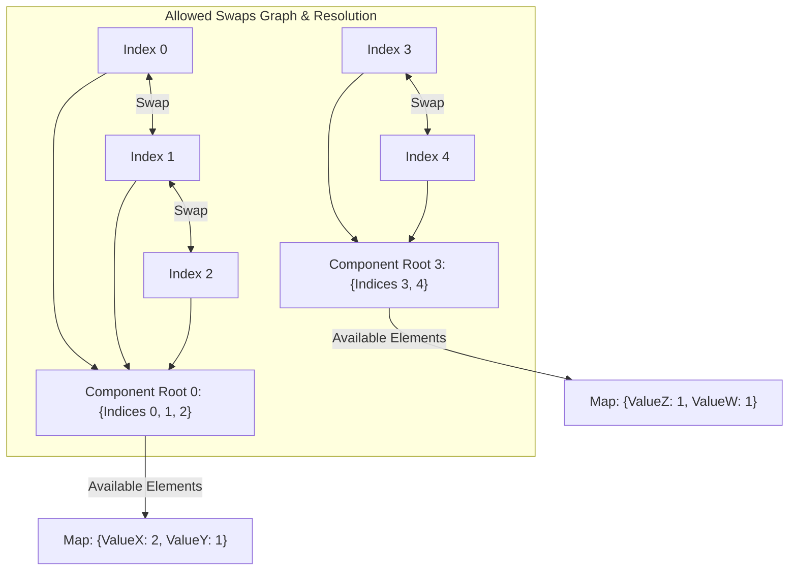

## 1722. Minimize Hamming Distance After Swap Operations
LeetCode Link: https://leetcode.com/problems/minimize-hamming-distance-after-swap-operations/

## The Problem
You are given two integer arrays, `source` and `target`, both of length `n`. You are also given an array `allowedSwaps` where each `allowedSwaps[i] = [a_i, b_i]` indicates that you are allowed to swap the elements at index `a_i` and index `b_i` in the `source` array. Note that you can perform these swaps in any order and any number of times.

The Hamming distance of two arrays is the number of positions where the elements are different. Return the minimum Hamming distance of `source` and `target` after performing any sequence of allowed swap operations on `source`.

## Architecture: Connected Components via Union-Find (DSU)

The trap here is attempting to simulate the swaps. The paradigm shift is realizing that the `allowedSwaps` define the edges of an undirected graph. 

**The Transitive Property of Swaps:**
If you can swap index `A` with `B`, and index `B` with `C`, you can effectively place the element from `A` into position `C`. Therefore, any elements whose indices belong to the same **Connected Component** in the graph can be freely rearranged into any permutation.

The architecture is a three-step pipeline:
1. **Union-Find:** Build the connected components of indices using a Disjoint Set Union (DSU) with Path Compression.
2. **Frequency Mapping:** For each component root, maintain a frequency map of the `source` elements present in that component.
3. **Target Resolution:** Iterate through the `target` array. If the required target element exists in the frequency map of that index's component, we consume it (decrement frequency). If it doesn't, that's a mandatory mismatch, so we increment the Hamming Distance.



## Approaches

| Approach | Time Complexity | Space Complexity | Why it fails/succeeds |
| :--- | :--- | :--- | :--- |
| **BFS/DFS for Components** | $O(N + E)$ | $O(N + E)$ | Valid approach. We can run BFS/DFS to find all connected indices, then map frequencies. However, building the adjacency list has a higher memory overhead and constant factor than DSU. |
| **Union-Find without Path Compression** | $O(N^2)$ | $O(N)$ | Fails L5 bar. If the graph forms a straight line, `find` operations degrade to $O(N)$, causing TLE on large inputs. |
| **Union-Find with Path Compression (Optimal)** | **$O(N \cdot \alpha(N))$** | **$O(N)$** | Highly optimal. $\alpha(N)$ is the Inverse Ackermann function, making the connected component grouping effectively $O(1)$ per element. |

## C++ Code: Disjoint Set Union (DSU)

```cpp
#include <vector>
#include <unordered_map>
#include <numeric>

using namespace std;

class Solution {
public:
    vector<int> parent;

    // Path Compression to guarantee O(alpha(N)) time complexity
    int find(int x) {
        if (x == parent[x]) return x;
        return parent[x] = find(parent[x]); 
    }

    void unite(int a, int b) {
        parent[find(a)] = find(b);
    }

    int minimumHammingDistance(vector<int>& source, vector<int>& target, vector<vector<int>>& allowedSwaps) {
        int n = source.size();
        parent.resize(n);
        iota(parent.begin(), parent.end(), 0); // Initialize each index as its own parent

        // 1. Build Connected Components
        for (auto& swap : allowedSwaps) {
            unite(swap[0], swap[1]);
        }

        // 2. Map available source elements per component
        // groups[component_root][element_value] = frequency
        unordered_map<int, unordered_map<int, int>> groups;
        for (int i = 0; i < n; ++i) {
            int root = find(i);
            groups[root][source[i]]++;
        }

        // 3. Resolve against Target array
        int hammingDistance = 0;
        for (int i = 0; i < n; ++i) {
            int root = find(i);
            int required_val = target[i];
            
            auto& freq = groups[root];
            
            if (freq.count(required_val) && freq[required_val] > 0) {
                // Element is available in this component pool, consume it
                freq[required_val]--;
            } else {
                // Element is missing from this component pool, mismatch found
                hammingDistance++;
            }
        }

        return hammingDistance;
    }
};
```

## Complexity Analysis
- **Time Complexity:** $O(N \cdot \alpha(N) + E \cdot \alpha(N))$. Initializing the DSU and processing $E$ swaps takes nearly linear time due to the Inverse Ackermann function $\alpha(N)$. Iterating through the arrays and updating the hash maps takes $O(N)$ time on average. Overall time is bounded tightly near $O(N + E)$.
- **Space Complexity:** $O(N)$. The `parent` array requires $O(N)$ space. The `groups` nested hash map stores exactly $N$ elements partitioned across the components, requiring $O(N)$ space.

## Real-World Use Case
### Cloud Resource Reallocation (Interchangeable Nodes)
In a distributed microservice cluster, you have an existing state of worker nodes (`source`) and a desired deployment state (`target`). However, due to strict Virtual Private Cloud (VPC) subnet boundaries and security group rules, certain worker nodes can only be hot-swapped or migrated across specific peered subnets (`allowedSwaps`). This algorithm determines the absolute minimum number of new nodes that must be forcefully spun up or destroyed (the Hamming Distance) because the desired migration topology is restricted by the network boundaries.
