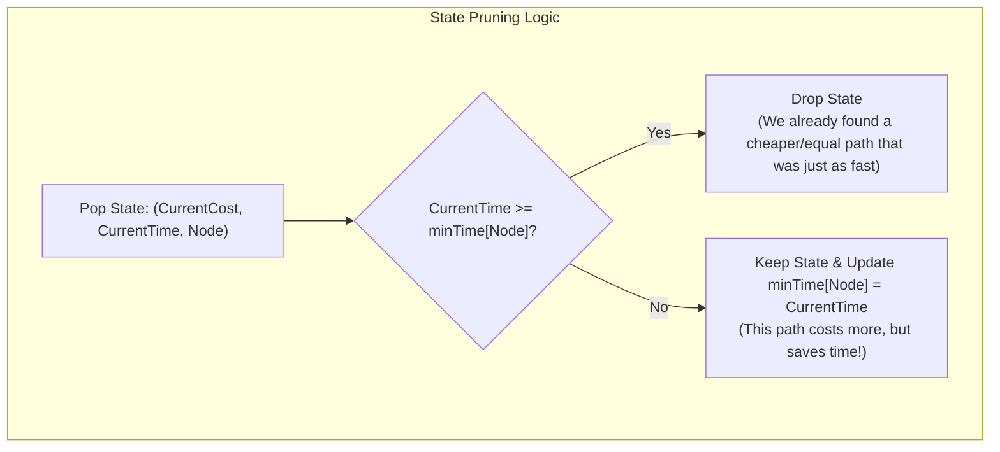

## 1928. Minimum Cost to Reach Destination in Time
LeetCode Link: https://leetcode.com/problems/minimum-cost-to-reach-destination-in-time/

## The Problem
There is a country of `n` cities numbered from `0` to `n - 1`. You are given a 2D array `edges` where `edges[i] = [x_i, y_i, time_i]` denotes that there is an undirected edge connecting city `x_i` and `y_i` that takes `time_i` minutes to travel. You are also given an array `passingFees`, where `passingFees[j]` is the toll you have to pay to enter city `j`.

You have `maxTime` minutes to travel from city `0` to city `n - 1`. Return the minimum cost (sum of passing fees) to complete the journey, or `-1` if it is impossible to reach the destination within the time limit.

## Architecture: State-Space Expansion Dijkstra

Standard Dijkstra's Algorithm finds the shortest path based on a single variable (e.g., distance or cost). However, this problem introduces two competing variables: we want to minimize **cost**, but we have a strict ceiling on **time**.

**The Paradigm Shift (State-Space Expansion):**
Our state cannot just be `node`. It must be `(node, time)`. 
We use a Priority Queue (Min-Heap) ordered primarily by **cumulative cost**. This ensures we always explore the cheapest financial routes first.

The trap is memory and time limit explosion. If we don't prune redundant paths, the queue will grow exponentially.
Instead of the standard `dist[node]` array, we maintain a `minTime[node]` array. 
Because our PQ pops paths in increasing order of cost, if we pop a node we've seen before, its cost is *guaranteed* to be higher (or equal). Therefore, we should only continue exploring this more expensive path **if and only if it arrived faster** than the previous cheaper paths. If it's more expensive AND slower, we instantly drop it.


## Approaches
| Approach | Time Complexity | Space Complexity | Why it fails/succeeds |
| :--- | :--- | :--- | :--- |
|Standard DFS Backtracking | $O(V!)$ | $O(V)$ |Trying all combinations of paths causes an immediate Time Limit Exceeded (TLE) error.|
| 2D Dynamic Programming | $O(E \cdot \text{maxTime})$ |$O(V \cdot \text{maxTime})$ | dp[time][node] tracks minimum cost. Highly optimal if maxTime is small, but wastes memory and compute if maxTime is massive and the graph is sparse.|
| State-Expanded Dijkstra (Optimal)| $O(E \log(V \cdot \text{maxTime}))$| $O(V + E)$ |Explores only the viable cost/time frontiers. The PQ efficiently guides us to the cheapest valid answer without computing the entire DP table.|
## Code
```cpp
#include <vector>
#include <queue>

using namespace std;

class Solution {
public:
    int minCost(int maxTime, vector<vector<int>>& edges, vector<int>& passingFees) {
        int n = passingFees.size();
        vector<vector<pair<int, int>>> adj(n);
        
        // 1. Build Adjacency List
        for (const auto& e : edges) {
            adj[e[0]].push_back({e[1], e[2]});
            adj[e[1]].push_back({e[0], e[2]});
        }
        
        // minTime tracks the absolute fastest we've reached a node so far.
        // Initialized to maxTime + 1 because any valid time will be <= maxTime.
        vector<int> minTime(n, maxTime + 1);
        
        // Min-Heap stores vectors of: {cost, time, node}
        // By default, C++ priority_queue with greater<> sorts by the first element (cost)
        priority_queue<vector<int>, vector<vector<int>>, greater<vector<int>>> pq;
        
        // Push the starting node (paying the fee for city 0 at time 0)
        pq.push({passingFees[0], 0, 0});
        
        while (!pq.empty()) {
            auto curr = pq.top();
            pq.pop();
            
            int cost = curr[0];
            int time = curr[1];
            int u = curr[2];
            
            // 2. Goal State
            // Because PQ pops by minimum cost, the first time we see n - 1, 
            // it is mathematically guaranteed to be the cheapest valid path.
            if (u == n - 1) {
                return cost;
            }
            
            // 3. L5 Pruning Logic
            // If we've been to this node faster (with a lesser or equal cost), drop it.
            if (time >= minTime[u]) {
                continue;
            }
            minTime[u] = time; // Record the new fastest time for this node
            
            // 4. Explore Neighbors
            for (const auto& edge : adj[u]) {
                int v = edge.first;
                int travelTime = edge.second;
                
                // Only push if the branch respects the hard time constraint
                if (time + travelTime <= maxTime) {
                    pq.push({cost + passingFees[v], time + travelTime, v});
                }
            }
        }
        
        return -1; // Journey impossible within maxTime
    }
};
```

## Complexity Analysis
- Time Complexity: $O(E \log(V \cdot \text{maxTime}))$. In the worst case, we could push multiple states for the same node into the priority queue (if each new path is more expensive but strictly faster). The priority queue operations dominate the time.
- Space Complexity: $O(V + E)$ to store the graph in the adjacency list, the minTime array, and the priority queue memory overhead.

## Real-World Use Case
Cloud Routing with SLAs (Service Level Agreements): When routing user data requests across distributed cloud data centers, crossing different network backbones incurs different financial costs (passingFees). A standard cloud orchestrator routes via the cheapest path. However, for premium enterprise clients, requests carry strict latency SLAs (maxTime). The orchestrator uses this exact expanded Dijkstra algorithm to find the absolute cheapest routing path that still mathematically guarantees the data arrives within the contracted milliseconds limit.
