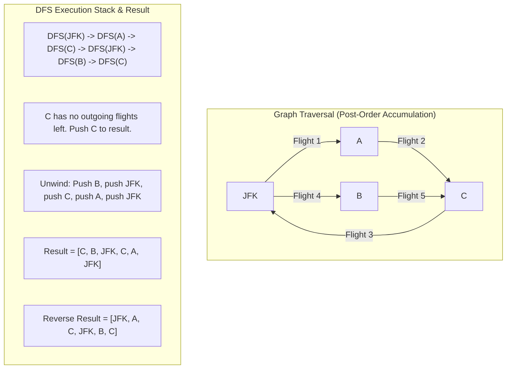

## 332. Reconstruct Itinerary
LeetCode Link: https://leetcode.com/problems/reconstruct-itinerary/

## The Problem
You are given a list of airline `tickets` where `tickets[i] = [from_i, to_i]` represent the departure and the arrival airports of one flight. Reconstruct the itinerary in order and return it.

All of the tickets belong to a man who departs from `"JFK"`, thus, the itinerary must begin with `"JFK"`. If there are multiple valid itineraries, you should return the itinerary that has the smallest lexical order when read as a single string. You must use all the tickets exactly once.

## Architecture: Hierholzer's Algorithm (Eulerian Path)

This is not a standard Graph DFS problem. Standard DFS finds paths that visit every *node* (Hamiltonian Path), which is NP-Hard. This problem asks us to visit every *edge* (flight) exactly once, which is an **Eulerian Path**.

The trap is that a greedy DFS might travel down a path that hits a "dead end" (an airport with no outgoing flights left) before using all tickets. 

**The Paradigm Shift (Hierholzer's Algorithm):**
We still use DFS, but we don't build the route as we go forward. Instead, we build the route **in post-order (on the way backwards)**. 
1. We keep flying until we hit an airport with no outgoing flights left. 
2. We add that "dead-end" airport to our result list. 
3. As the recursion unwinds, we add the preceding airports.
4. Finally, we reverse the result list. 

By sorting the destinations in descending lexical order, we can pop the smallest destination from the back of the vector in $O(1)$ time, guaranteeing the lexicographically smallest path without $O(N)$ memory shifting overhead.



## Approaches

| Approach | Time Complexity | Space Complexity | Why it fails/succeeds |
| :--- | :--- | :--- | :--- |
| **Greedy DFS + Backtracking** | $O(E^d)$ | $O(E)$ | Attempting to guess the right path and backtracking when hitting a dead-end before using all tickets results in massive exponential branch exploration. Causes Time Limit Exceeded (TLE). |
| **Hierholzer's Algorithm (Optimal)** | **$O(E \log E)$** | **$O(V + E)$** | Processes the graph into an Eulerian path cleanly. The $O(E \log E)$ comes strictly from sorting the adjacency lists upfront. The graph traversal itself is strictly $O(E)$. |

## C++ Code: Hierholzer's Algorithm

```cpp
#include <vector>
#include <string>
#include <unordered_map>
#include <algorithm>
#include <functional>

using namespace std;

class Solution {
public:
    vector<string> findItinerary(vector<vector<string>>& tickets) {
        unordered_map<string, vector<string>> adjList;

        // 1. Build the Adjacency List
        for (const auto& ticket: tickets) {
            adjList[ticket[0]].push_back(ticket[1]);
        }

        // 2. Sort destinations in strictly DESCENDING order.
        // This allows us to use pop_back() in O(1) time to get the 
        // lexicographically smallest destination.
        for (auto& [src, dests] : adjList) {
            sort(dests.rbegin(), dests.rend());
        }

        vector<string> result;

        // 3. Post-Order DFS Lambda
        function<void(const string& )> dfs = [&](const string& airport) {
            // While there are outgoing flights from this airport
            while(!adjList[airport].empty()) {
                string next = adjList[airport].back();
                adjList[airport].pop_back(); // O(1) removal of the edge
                dfs(next);
            }
            // 4. Dead end reached, push to result on the way up the call stack
            result.push_back(airport);
        };

        dfs("JFK");
        
        // 5. The result is built backwards, so reverse it for the final itinerary
        reverse(result.begin(), result.end());
        
        return result;
    }
};
```

## Complexity Analysis
- **Time Complexity:** $O(E \log E)$, where $E$ is the number of tickets. Sorting the destinations across all airports takes bounded $O(E \log E)$ time. The DFS traversal visits every edge exactly once, which takes $O(E)$ time. 
- **Space Complexity:** $O(V + E)$. The adjacency list stores all vertices $V$ and edges $E$. The recursion stack depth can go up to $E$ in the worst-case scenario where all flights form a single continuous line.

## Real-World Use Case
### Genome Sequencing (De Bruijn Graphs)
Hierholzer's algorithm is the exact mathematical engine used in Bioinformatics for DNA sequencing. When analyzing massive DNA strands, sequencing machines break the DNA into millions of tiny overlapping fragments (k-mers). These fragments are modeled as edges on a De Bruijn graph. Reconstructing the original, unbroken DNA sequence requires finding a continuous path that utilizes every single sequenced fragment (edge) exactly once—a textbook Eulerian path implementation.
