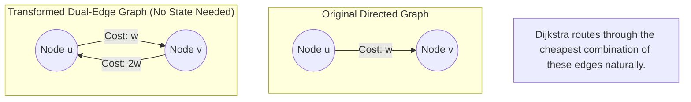

## Minimum Cost Path with Edge Reversals
LeetCode Link: https://leetcode.com/problems/minimum-cost-path-with-edge-reversals/

## The Problem
You are given a directed graph with `n` nodes. You are given an array `edges` where `edges[i] = [u, v, cost]` indicates a directed edge from `u` to `v` with a certain cost. 
Each node has a switch that can be used *at most once*. When a node's switch is used, you can reverse the direction of one of its outgoing edges, but the cost of traversing that reversed edge becomes `2 * original_cost`.
Return the minimum cost to travel from node `0` to node `n-1`.

## Architecture: Dual-Edge Transformation + Dijkstra

The wording "a switch can be used at most once per node" is a psychological trap designed to make engineers think they need to track complex state (e.g., bitmasks or `visited[node][switch_used]`).

**The Paradigm Shift:**
Because all original edge weights are strictly positive ($w \ge 1$), and reversed weights are also positive ($2w \ge 2$), any optimal shortest path will **never contain a cycle**. If a path never contains a cycle, we will naturally only visit each node at most once. If we only step on a node once, it is mathematically impossible to use its switch more than once!

Therefore, we can drop all state tracking and simply transform the graph upfront:
For every directed edge `u -> v` with cost `w`, we add two edges to our adjacency list:
1. `u -> v` with cost `w`
2. `v -> u` with cost `2 * w`

We then run standard Dijkstra's Algorithm. The algorithm will automatically route the cheapest path, natively respecting the rules without needing custom validation.


## Approaches
| Approach | Time Complexity | Space Complexity | Why it fails/succeeds |
| :--- | :--- | :--- | :--- |
|DFS with Backtracking (State Tracking) | $O(E!)$ |$O(V)$ | Trying to physically modify the graph state and backtrack creates an exponential branch explosion, causing Time Limit Exceeded (TLE). |
| Dual-Edge Dijkstra (Optimal)| $O(E \log V)$ | $O(V + E)$ | Bypasses all state tracking. By transforming the graph upfront, it utilizes the highly optimized $O(E \log V)$ priority queue to find the answer mathematically. |

## Code
```cpp
#include <vector>
#include <queue>

using namespace std;

class Solution {
public:
    int minCost(int n, vector<vector<int>>& edges) {
        vector<vector<pair<int, int>>> adjList(n);
        vector<int> dis(n, 1e9);

        // 1. Dual-Edge Transformation
        for (const auto& edge : edges) {
            adjList[edge[0]].push_back( {edge[1], edge[2]} );
            adjList[edge[1]].push_back( {edge[0], 2 * edge[2]} );
        }

        // Min-Heap: stores {cost_so_far, current_node}
        priority_queue<pair<int, int>, vector<pair<int, int>>, greater<pair<int, int>>> pq;

        pq.push({0, 0});
        dis[0] = 0;

        // 2. Standard Dijkstra's Algorithm
        while(!pq.empty()) {
            auto [w, node] = pq.top(); pq.pop();

            // L5 Optimization: Ignore stale paths in the priority queue
            if (w > dis[node]) continue;

            for (auto& neigh : adjList[node]) {
                if (dis[neigh.first] > w + neigh.second) {
                    dis[neigh.first] = w + neigh.second;
                    pq.push({dis[neigh.first], neigh.first});
                }
            }
        }
        
        return dis[n-1] != 1e9 ? dis[n-1] : -1;
    }
};
```

## Complexity Analysis
- Time Complexity: $O(E \log V)$. We double the number of edges during the transformation ($2E$), but constant factors are dropped in Big O. The priority queue operations strictly bound to standard Dijkstra time.
- Space Complexity: $O(V + E)$ for the adjacency list containing all nodes and the newly doubled edges, plus the priority queue memory.

## Real-World Use Case
- Navigation & Routing (Wrong-Way Penalties) :

  When building routing engines for maps (like Google Maps or Expedia's local transport planner), driving down a one-way street the wrong way is illegal. However, for emergency vehicles (ambulances, fire trucks), traveling against traffic is permitted but highly dangerous and slow. We map normal directional roads with standard time weights, and reverse-directional roads with heavy penalty weights. The routing engine then seamlessly calculates the safest emergency route.
