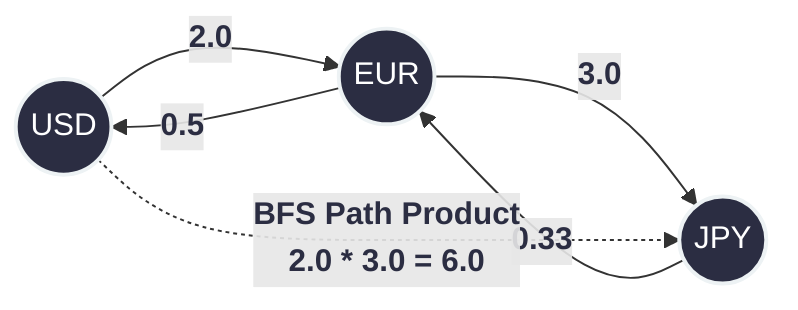

# 399. Evaluate Division
https://leetcode.com/problems/evaluate-division/description/

## The Problem
Given an array of variable pairs `equations` and an array of real numbers `values`, where `equations[i] = [Ai, Bi]` and `values[i]` represent the equation $A_i / B_i = values[i]$. Return the answers to a list of `queries` (where a query is evaluating $C_j / D_j$). If a single answer cannot be determined, return `-1.0`.

---

## The Architecture: Directed Weighted Graphs
Equations are just directed graph edges. If $A / B = 2.0$, that means traversing from $A$ to $B$ multiplies our state by $2.0$. The mathematical inverse means traversing from $B$ to $A$ multiplies our state by $1 / 2.0 = 0.5$.

To answer a query like $A / C$, we just need to find a path from $A$ to $C$ and multiply the weights along the edges.

### BFS State Accumulation
Instead of summing distances (like Dijkstra), we accumulate a **running product**. 
1. Push `{start_node, 1.0}` to the queue.
2. For each neighbor, the new state is `current_product * edge_weight`.
3. If we hit the destination node, return the accumulated product.

---

## 💻 The Production Code (C++)
```cpp
class Solution {
public:
    vector<double> calcEquation(vector<vector<string>>& equations, vector<double>& values, vector<vector<string>>& queries) {
        unordered_map<string, vector<pair<string, double>>> graph;
        for (int i = 0; i < equations.size(); ++i) {
            graph[equations[i][0]].push_back({equations[i][1], values[i]});
            graph[equations[i][1]].push_back({equations[i][0], 1.0 / values[i]});
        }

        vector<double> result;
        for (const auto& query : queries) {
            result.push_back(bfs(query[0], query[1], graph));
        }
        return result;
    }

private:
    double bfs(const string& src, const string& dst, unordered_map<string, vector<pair<string, double>>>& graph) {
        if (graph.find(src) == graph.end() || graph.find(dst) == graph.end()) return -1.0;
        if (src == dst) return 1.0;

        queue<pair<string, double>> q;
        unordered_set<string> vis; 
        q.push({src, 1.0});
        vis.insert(src);

        while (!q.empty()) {
            auto [node, current_product] = q.front();
            q.pop();

            if (node == dst) return current_product;

            for (const auto& neigh : graph[node]) {
                if (vis.find(neigh.first) == vis.end()) {
                    vis.insert(neigh.first);
                    q.push({neigh.first, current_product * neigh.second});
                }
            }
        }
        return -1.0; // Target not reachable
    }
};
```

## Complexity Analysis
- Time Complexity: $O(Q \times (V + E))$ — For each of the $Q$ queries, we potentially run a full BFS traversing $V$ nodes (variables) and $E$ edges (equations).
- Space Complexity: $O(V + E)$ — To store the Adjacency List graph and the BFS visited set.

## System Design Context:  Forex Arbitrage & Unit Converters
  1. Currency Exchange (Forex) Routing :
     If a system has the exchange rates for USD -> EUR and EUR -> JPY, it can instantly calculate USD -> JPY by multiplying the path weights. In High-Frequency Trading (HFT), if a graph cycle is found where the product is $> 1.0$ (e.g., USD -> EUR -> JPY -> USD yields $1.02$), it triggers an Arbitrage Trade to print risk-free money.

  2. Dynamic Unit Conversion Systems: 
     Hardcoding every possible physical unit conversion (Meters to Inches, Fathoms to Lightyears) is impossible. Instead, systems store a sparse graph of known conversions (e.g., 1 inch = 2.54 cm, 100 cm = 1 meter). When a user asks for Meters -> Inches, the system runs this exact BFS to dynamically construct the conversion rate on the fly.


