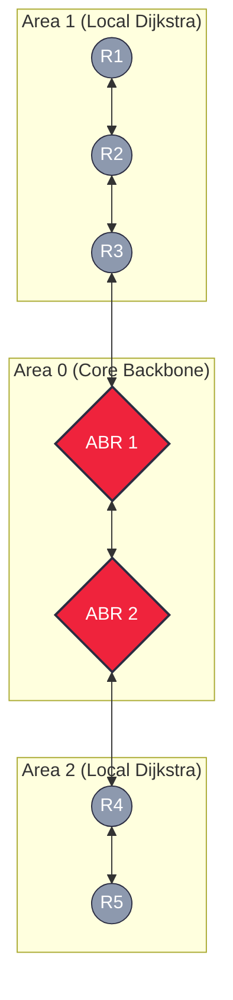

# 743. Network Delay Time (Dijkstra's Algorithm)
https://leetcode.com/problems/network-delay-time/description/

## The Problem
Given a network of `n` nodes, labeled from `1` to `n`. You are given `times`, a list of travel times as directed edges `times[i] = (u, v, w)`, where `u` is the source node, `v` is the target node, and `w` is the time it takes for a signal to travel from source to target. We send a signal from a given node `k`. Return the minimum time it takes for all the `n` nodes to receive the signal. If it is impossible, return `-1`.

##  The Architecture (Dijkstra's & Priority Queue Physics)
This is a textbook Shortest Path problem on a weighted, directed graph. The optimal architecture is **Dijkstra's Algorithm**.
1. **The Graph Representation:** Because node IDs are a dense, continuous sequence (`1` to `n`), we use a `vector<vector<pair>>` instead of an `unordered_map`. This eliminates hashing overhead and maximizes CPU cache locality.
2. **The Sorting Invariant:** The Priority Queue (Min-Heap) must store elements as `{current_time, node_id}`. C++ pairs sort by the first element. If we put the node ID first, the heap degrades into a standard queue, ruining the $O(E \log V)$ time complexity.
3. **Stale State Pruning:** Since we push updated distances to the heap without deleting old ones, we must check `if (curr_time > ans[node]) continue;` upon popping. This "Lazy Deletion" prevents the algorithm from exploring branches using obsolete, slower routes.

##  The C++ Production Code
```cpp
class Solution {
public:
    int networkDelayTime(vector<vector<int>>& times, int n, int k) {
        // Size is n + 1 because nodes are 1-indexed
        vector<vector<pair<int, int>>> adjList(n + 1);
        for (const auto& time : times) {
            adjList[time[0]].push_back({time[1], time[2]});
        }

        vector<int> ans(n + 1, INT_MAX);
        ans[k] = 0;

        // The pair MUST be {time, node} so the heap sorts by time
        priority_queue<pair<int, int>, vector<pair<int, int>>, greater<pair<int, int>>> pq;
        pq.push({0, k}); 

        while (!pq.empty()) { 
            auto [curr_time, node] = pq.top();
            pq.pop();

            if (curr_time > ans[node]) continue;

            for (auto& neigh : adjList[node]) {
                int next_node = neigh.first;
                int travel_time = neigh.second;

                if (ans[next_node] > curr_time + travel_time) {
                    ans[next_node] = curr_time + travel_time;
                    pq.push({ans[next_node], next_node});
                }
            }
        }

        int result = 0; // Can start at 0 since time can't be negative
        for (int i = 1; i <= n; ++i) {
            if (ans[i] == INT_MAX) return -1;
            result = max(ans[i], result);
        }

        return result;
    }
};
```
## Complexity AnalysisTime Complexity: 
- $O(E \log V)$, where $E$ is the number of edges and $V$ is the number of vertices. The Min-Heap operations dominate the execution time.
- Space Complexity: $O(V + E)$ to store the adjacency list, plus $O(V)$ for the priority queue and distances array.

## System Design Context: Internet Routing Protocols (OSPF)

This algorithm is the exact mathematical foundation for OSPF (Open Shortest Path First), an interior gateway protocol used to route IP packets across large enterprise networks.
The Bottleneck: What if the graph is the entire global internet (millions of autonomous systems)? Dijkstra's algorithm becomes too slow and memory-intensive to run on a single router.

### The Distributed Solution:

- Hierarchical Routing (Areas): Instead of one massive graph, OSPF breaks the network into localized "Areas". A router only runs Dijkstra for nodes within its specific Area.
- Area Border Routers (ABRs): To talk to a different Area, packets are routed to an ABR. The ABR summarizes the costs to reach other Areas, effectively abstracting millions of
  nodes into a single edge weight.


