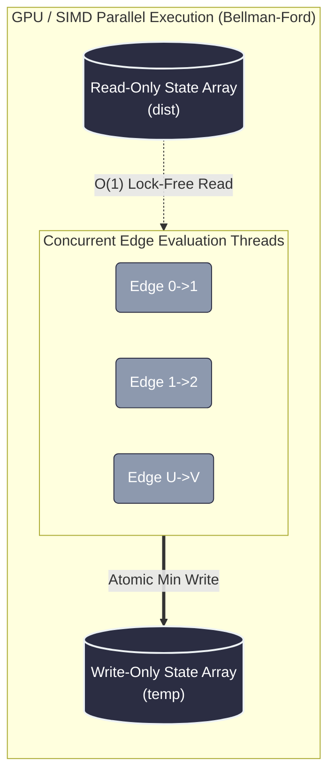

# 787. Cheapest Flights Within K Stops
https://leetcode.com/problems/cheapest-flights-within-k-stops/

## The Problem
Given `n` cities connected by some number of `flights` (where `flights[i] = [from, to, price]`), find the cheapest flight path from a `src` city to a `dst` city with **at most `k` stops**. If no such route exists, return `-1`.

---

## The Architecture: The "Dijkstra Trap" vs. Bellman-Ford
A common pitfall is attempting to use Dijkstra's Algorithm with a modified Priority Queue to track stops. 

** The Dijkstra Trap:** Dijkstra explores greedily based on the absolute lowest cost. It will find a mathematically cheap path that uses many flights, and aggressively update the minimum distance array. When a slightly more expensive path arrives that uses *fewer* flights, Dijkstra prunes it. This starves the graph, destroying valid routes that are needed to satisfy the strict `k` constraint later in the journey. Dijkstra is fundamentally designed for *unbounded* routing.

** The Bellman-Ford Solution:** When a system imposes a hard physical limit on network hops (like `K` stops), the mathematically optimal architecture is **Bellman-Ford**. By relaxing all edges level-by-level exactly `K + 1` times, we mathematically guarantee that paths are evaluated by their hop-count, completely eliminating the risk of cost-greedy starvation.

---

##  The Production Code (C++)

### Approach 1: Using standard BFS

```cpp
#include <vector>
#include <queue>

using namespace std;

class Solution {
public:
    int findCheapestPrice(int n, vector<vector<int>>& flights, int src, int dst, int k) {

        vector<vector<pair<int, int>>> adj(n);
        for (auto& f : flights) {
            adj[f[0]].push_back({f[1], f[2]});
        }

        vector<int> minCost(n, INT_MAX);
        minCost[src] = 0;

        // Standard Queue for Level-Order BFS: {node, current_cost}
        queue<pair<int, int>> q;
        q.push({src, 0});

        int stops = 0;

        while (!q.empty() && stops <= k) {
            int size = q.size();
            
            while (size--) {
                auto [u, cost] = q.front();
                q.pop();

                for (auto& edge : adj[u]) {
                    int v = edge.first;
                    int weight = edge.second;

                    if (cost + weight < minCost[v]) {
                        minCost[v] = cost + weight;
                        q.push({v, cost + weight});
                    }
                }
            }
            stops++;
        }

        return minCost[dst] == INT_MAX ? -1 : minCost[dst];
    }
};
```
### Approach 2: 
This implementation uses a highly optimized, flat-array Dynamic Programming approach (Space-Optimized Bellman-Ford) rather than a complex BFS Queue with an Adjacency List.

Instead of building a complex Adjacency List and maintaining a Queue, we can iterate directly over the flat list of edges. We relax all edges exactly `k + 1` times.

#### The Architecture & Hardware Optimization
1. **Cache Locality:** Iterating over a contiguous array of edges is incredibly friendly to the CPU's L1/L2 cache compared to pointer-chasing through an adjacency list.
2. **Space Complexity:** Drops from $O(V + E)$ down to strictly $O(V)$ because we only need two arrays (`dist` and `temp`) to track costs.
3. **State Isolation:** By reading from a read-only `dist` array and writing to a `temp` array, we prevent "flight chaining" (taking multiple flights in a single iteration step). 
4. **Distributed Computing:** Because the edge-list evaluation is completely flat, this architecture is highly parallelizable and is the standard way to run graph algorithms on GPUs (CUDA) or big-data MapReduce frameworks (Apache Giraph).

```cpp
class Solution {
public:
    int findCheapestPrice(int n, vector<vector<int>>& flights, int src, int dst, int k) {
        // Initialize distances to a large number (1e9 prevents integer overflow)
        vector<int> dist(n, 1e9);
        dist[src] = 0;

        // Relax edges exactly k + 1 times (k stops = k + 1 flights)
        for (int i = 0; i <= k; ++i) {
            vector<int> temp = dist;
            
            for (const auto& edge : flights) {
                int u = edge[0];
                int v = edge[1];
                int weight = edge[2];

                // If the source node is reachable, relax the edge
                if (dist[u] != 1e9 && dist[u] + weight < temp[v]) {
                    temp[v] = dist[u] + weight;
                }
            }
            // Move forward in time for the next iteration
            dist = temp;
        }

        return dist[dst] == 1e9 ? -1 : dist[dst];
    }
};
```
## Complexity Analysis
- Time Complexity: $O(K \times E)$ — We process at most $E$ edges for each of the $K$ levels. This is significantly faster and more stable than a bounded Dijkstra, which can degrade to exponential time if the state space (node, stops) explodes.
- Space Complexity: $O(V + E)$ for the adjacency list and the BFS queue.

## System Design Context

### Time-to-Live (TTL) & Packet Drops

1. Distance Vector Routing (RIP vs. OSPF)

While Dijkstra maps to OSPF (where every router needs the entire network map), Bellman-Ford maps directly to RIP (Routing Information Protocol). A router does not need to know the entire global topology. It only looks at its immediate neighbors (the edge list) and calculates its distance based on its neighbors' reported distances. This uses significantly less memory on embedded network switches.

2. Time-To-Live (TTL) Constraints

In distributed networking, packets are assigned a TTL (Time-To-Live) integer to prevent them from bouncing around the internet infinitely. This algorithm mirrors exactly how network controllers calculate optimal routing paths under strict TTL hop limits, ensuring data reaches its destination before the physical network drops it.

3. CPU Cache Locality & GPU Acceleration

Iterating over a contiguous array of edges vector<vector<int>> is incredibly friendly to the CPU's L1/L2 cache compared to pointer-chasing through a nested Adjacency List. Furthermore, because the edge-list evaluation is completely flat, this architecture is massively parallelizable. It is the standard way to run graph algorithms on GPUs (CUDA) or big-data MapReduce frameworks (Apache Giraph), where millions of edges are evaluated concurrently without complex thread locking.


