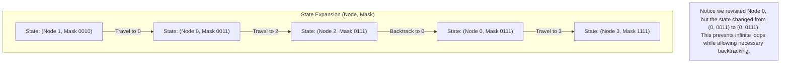

## 847. Shortest Path Visiting All Nodes
LeetCode Link: https://leetcode.com/problems/shortest-path-visiting-all-nodes/

## The Problem
You have an undirected, connected graph of `n` nodes labeled from `0` to `n - 1`. You are given an array `graph` where `graph[i]` is a list of all the nodes connected with node `i` by an edge.

Return the length of the shortest path that visits **every** node. You may start and stop at any node, you may revisit nodes multiple times, and you may reuse edges.

## Architecture: Multi-source Bitmask BFS

Standard BFS uses a 1D `visited` array to prevent infinite loops. However, in this problem, we *must* revisit nodes if they act as bridges to unvisited parts of the graph. If we allow revisiting without restrictions, the BFS runs infinitely.

The paradigm shift is expanding the definition of "State". Our state cannot just be the `current_node`. It must be `(current_node, nodes_collected_so_far)`. We only prevent a revisit if we return to a node **and we haven't collected any new nodes since the last time we were there.**

Because $N \le 12$, we can represent "nodes collected so far" as a 12-bit integer (Bitmask).
- Node 0 visited: `0001` (Decimal 1)
- Nodes 0 and 2 visited: `0101` (Decimal 5)
- All 4 nodes visited: `1111` (Decimal 15)



## Approaches

| Approach | Time Complexity | Space Complexity | Why it fails/succeeds |
| :--- | :--- | :--- | :--- |
| **Standard BFS** | $\infty$ | $O(N)$ | Gets trapped in infinite loops between nodes because there is no mechanism to track *why* a node is being revisited. |
| **DFS with Backtracking** | $O(N!)$ | $O(N)$ | Exploring all possible paths mathematically explodes, resulting in a Time Limit Exceeded (TLE) error. |
| **Multi-source Bitmask BFS (Optimal)** | **$O(N^2 \cdot 2^N)$** | **$O(N \cdot 2^N)$** | Tracks state perfectly. Since we process level by level, the first state that reaches the target mask is mathematically guaranteed to be the shortest path. |

## C++ Code: Multi-source Bitmask BFS

```cpp
#include <vector>
#include <queue>
#include <tuple>

using namespace std;

class Solution {
public:
    int shortestPathLength(vector<vector<int>>& graph) {
        int n = graph.size();
        if (n == 1) return 0;
        
        // Target mask when all nodes are visited (e.g., for N=4, target is 1111 in binary)
        int target_mask = (1 << n) - 1;
        
        // Queue stores tuples of: (current_node, current_mask, distance)
        queue<tuple<int, int, int>> q;
        
        // Visited array expands to 2D to track the state: visited[node][mask]
        vector<vector<bool>> visited(n, vector<bool>(1 << n, false));
        
        // 1. Initialize Multi-source BFS by pushing every node as a starting point
        for (int i = 0; i < n; i++) {
            int initial_mask = 1 << i;
            q.push({i, initial_mask, 0});
            visited[i][initial_mask] = true;
        }
        
        // 2. BFS Execution
        while (!q.empty()) {
            auto [u, mask, dist] = q.front();
            q.pop();
            
            // Explore all neighbors
            for (int v : graph[u]) {
                // Calculate the new mask if we visit node v
                int next_mask = mask | (1 << v);
                
                // If we hit the target, we found the shortest path
                if (next_mask == target_mask) {
                    return dist + 1;
                }
                
                // If this specific state hasn't been explored, queue it up
                if (!visited[v][next_mask]) {
                    visited[v][next_mask] = true;
                    q.push({v, next_mask, dist + 1});
                }
            }
        }
        
        return 0; // Should never reach here if graph is connected
    }
};
```

## Complexity Analysis
- **Time Complexity:** $O(N^2 \cdot 2^N)$. There are $N \cdot 2^N$ possible states `(node, mask)`. From each state, we can transition to at most $N$ neighbors. Therefore, the BFS processes at most $N^2 \cdot 2^N$ edges.
- **Space Complexity:** $O(N \cdot 2^N)$ to store the `visited` array and the BFS `queue`.

## Real-World Use Case
### Network Packet Inspection Routing
In secure cloud architectures, a network packet might need to be routed through a specific set of security inspection microservices (e.g., Firewall, Deep Packet Inspection, Auth Gateway) before it is allowed to reach the database. The network topology might not have direct connections between all these services, requiring the packet to backtrack through a central switch or router multiple times. This algorithm instantly finds the absolute shortest routing path to "collect" all required security validations.
