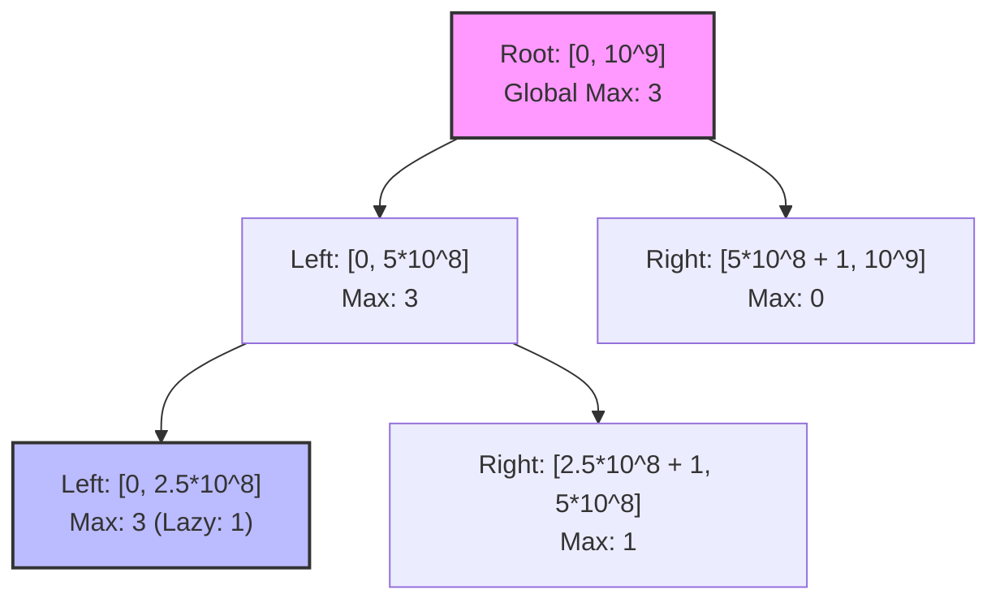

## Problem Statement
732. My Calendar III https://leetcode.com/problems/my-calendar-iii/

A k-booking happens when k events have some non-empty intersection (i.e., there is some time that is common to all k events.) You are implementing a program to add a new event to a calendar and 
return the maximum k-booking across all events added so far.

Note: The event is a half-open interval $[startTime, endTime)$, meaning startTime is inclusive but endTime is exclusive. 

Constraints $0 <= startTime < endTime <= 10^9$ At most 400 calls will be made to book.

Brute Force IdeaMaintain a $std::map<int, int>$ as a Sweep-Line. For every booking, increment the startTime by 1 and decrement the endTime by 1. 
Then, iterate through the entire map from beginning to end to calculate the maximum running sum of active overlapping bookings.

Time Complexity: $O(N)$ per booking (where $N$ is the number of unique timestamps). Total time $O(N^2)$.
Space Complexity: $O(N)$ to store the timestamps.The Architecture: 

## OptimalAlgorithm: Dynamic Segment Tree with Lazy Propagation.
- Data Structure: Pointer-based Tree Nodes.Instead of scanning the entire timeline on every write, we treat the timeline as a massive segment $[0, 10^9]$.
- Because allocating an array of size $10^9$ would crash the memory, we dynamically allocate tree nodes only when a specific time segment is booked.
- We use Lazy Propagation: if a booking completely covers a node's time segment, we just tag the node and stop traversing, pushing the update down to its children only if needed later.
- The global maximum overlap is always instantly available at the Root Node.

## Brute Force Approach (Still valid for leetcode with <500 calls to book API)
```cpp
class MyCalendarThree {
private:
map<int, int> sweepLine;

public:
    MyCalendarThree() {
    }
    
    int book(int startTime, int endTime) {
        sweepLine[startTime] ++;
        sweepLine[endTime]--;

        int localOverlap = 0;
        int globalOverlap = 0;
        for(const auto &event: sweepLine ) {
            localOverlap+= event.second;
            globalOverlap = max(globalOverlap, localOverlap);
        }
        return globalOverlap;
    }
};
```

## Segment Tree Code
```cpp
#include <algorithm>

using namespace std;

class Node {
public:
    int max_val;
    int lazy;
    Node* left;
    Node* right;

    Node() : max_val(0), lazy(0), left(nullptr), right(nullptr) {}

    ~Node() {
        // Prevent memory leaks when the Calendar is destroyed
        delete left;
        delete right;
    }
};

class MyCalendarThree {
private:
    Node* root;
    const int MAX_TIME = 1e9;

    void update(Node* node, int start, int end, int left_query, int right_query) {
        // Base case: current segment is completely inside the booking interval
        if (left_query <= start && end <= right_query) {
            node->max_val += 1;
            node->lazy += 1;
            return;
        }

        int mid = start + (end - start) / 2;

        // Dynamically create children only when needed
        if (!node->left) node->left = new Node();
        if (!node->right) node->right = new Node();

        // Lazy Propagation: Push pending updates down to children
        if (node->lazy > 0) {
            node->left->max_val += node->lazy;
            node->left->lazy += node->lazy;
            
            node->right->max_val += node->lazy;
            node->right->lazy += node->lazy;
            
            node->lazy = 0; // Clear the tag
        }

        // Partial overlap: traverse the relevant children
        if (left_query <= mid) {
            update(node->left, start, mid, left_query, right_query);
        }
        if (right_query > mid) {
            update(node->right, mid + 1, end, left_query, right_query);
        }

        // Update current node's max based on its children
        node->max_val = max(node->left->max_val, node->right->max_val);
    }

public:
    MyCalendarThree() {
        root = new Node();
    }
    
    int book(int startTime, int endTime) {
        // endTime is exclusive, so we query up to endTime - 1
        update(root, 0, MAX_TIME, startTime, endTime - 1);
        
        // The root node always holds the global maximum across the entire timeline
        return root->max_val;
    }

    ~MyCalendarThree() {
        delete root; // Triggers the recursive destructor in the Node class
    }
};
```

- Optimal Time Complexity: $O(\log T)$ per booking, where $T$ is the maximum timeline ($10^9$).
- Optimal Space Complexity: $O(N \log T)$ where $N$ is the number of bookings, as each booking creates at most $O(\log T)$ nodes.

## System Design Context

- High-Throughput Inventory Management (Expedia/ booking.com / AWS EC2): 
When a system handles millions of overlapping requests (like reserving hotel rooms for specific dates, or allocating server CPUs over a time window), reading the entire database on every transaction to find the peak load is impossible.
A Segment Tree allows the backend to update a massive, continuous time-series block in $O(\log T)$ time while keeping the absolute peak global load cached at the root for instantaneous $O(1)$ querying by load balancers or rate limiters.


