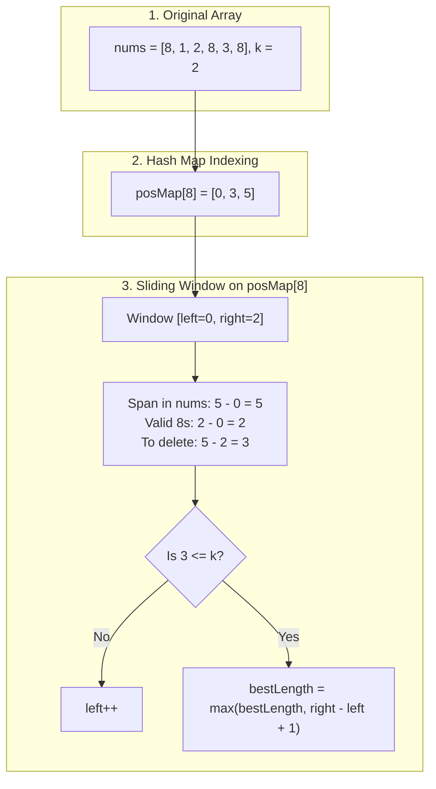

## 2831. Find the Longest Equal Subarray
LeetCode Link: https://leetcode.com/problems/find-the-longest-equal-subarray/

## The Problem
Given an integer array `nums` and an integer `k`, return the length of the longest subarray where all elements are equal, after deleting at most `k` elements from the array.

## Architecture: Mapped Indices + Sliding Window

Standard sliding window struggles here because we are looking for the longest sequence of *any* number, and the "garbage" elements between them can vary wildly. 

To solve this efficiently in $O(N)$ time, we decouple the sliding window from the original array.
1. **Hash Map Grouping:** We group the indices of identical elements into a `std::unordered_map<int, vector<int>>`.
2. **Targeted Sliding Window:** We run a sliding window `[left, right]` strictly over these mapped index arrays. 
3. **Deletion Math:** The number of elements we must delete is the physical span in the original array (`pos[right] - pos[left] + 1`) minus the number of valid target elements we've collected (`right - left + 1`). This simplifies nicely to `(pos[right] - pos[left]) - (right - left)`.



## Approaches
| Approach | Time Complexity | Space Complexity | Why it fails/succeeds |
| :--- | :--- | :--- | :--- |
| **Brute Force** | $O(N^2)$ | $O(N)$ | Iterating over all possible subarrays and counting frequencies is far too slow for $N = 10^5$. |
| **Single Pass Sliding Window** | $O(N)$ | $O(N)$ | Maintains a frequency map and a `maxFrequency` variable. If `window_length - maxFrequency > k`, it shrinks. Extremely efficient, but requires unintuitive state management (not decrementing `maxFrequency` when shrinking). |
| **Grouped Indices + Sliding Window (Optimal)** | **$O(N)$** | **$O(N)$** | The most architecturally sound approach. Iterating over the mapped index arrays guarantees we only process relevant elements, making the math predictable and strictly linear. |

## Grouped Indices + Sliding Window
```cpp
#include <vector>
#include <unordered_map>
#include <algorithm>

using namespace std;

class Solution {
public:
    int longestEqualSubarray(vector<int>& nums, int k) {
        unordered_map<int, vector<int>> positions;
        int bestGlobalLength = 0;

        // 1. Map the VALUE to the INDEX
        for (int idx = 0; idx < nums.size(); ++idx) {
            positions[nums[idx]].push_back(idx);
        }

        // 2. Sliding Window over the mapped index arrays
        for (const auto& post : positions) {
            const auto& pos = post.second; 
            int left = 0;
            int bestLocalLength = 0;

            for (int right = 0; right < pos.size(); ++right) {
                
                // Elements to delete = (Total Span) - (Valid Elements)
                int x = (pos[right] - pos[left]) - (right - left);

                // Shrink window while we need to delete more than K elements
                while ((left <= right) && (x > k)) {
                    left++;
                    x = (pos[right] - pos[left]) - (right - left);
                }
                
                // Length is strictly the number of target elements in our window
                bestLocalLength = max(bestLocalLength, right - left + 1);
            }
            bestGlobalLength = max(bestGlobalLength, bestLocalLength);
        }
        return bestGlobalLength;
    }
};
```

## Complexity Analysis
- Time Complexity: $O(N)$. We iterate through nums once to build the map. Then, each index in the mapped vectors is processed by the left and right pointers at most twice. The aggregate execution time of the inner loops across all unique numbers bounds strictly to $N$.
- Space Complexity: $O(N)$ to store all the indices within the Hash Map.

## Real-World Use Case

LLM Streaming Context Extraction & Noise ToleranceThis algorithm models sliding window context management for multimodal Large Language Model (LLM) streaming pipelines. In a production orchestration backend processing millions of token events, network jitter or interleaved background noise might inject garbage tokens into a user's voice packet stream. If the system can tolerate up to k dropped/corrupted packets, this algorithm efficiently extracts the longest contiguous, valid interaction context without performing heavy $O(N^2)$ recalculations on the buffer.
