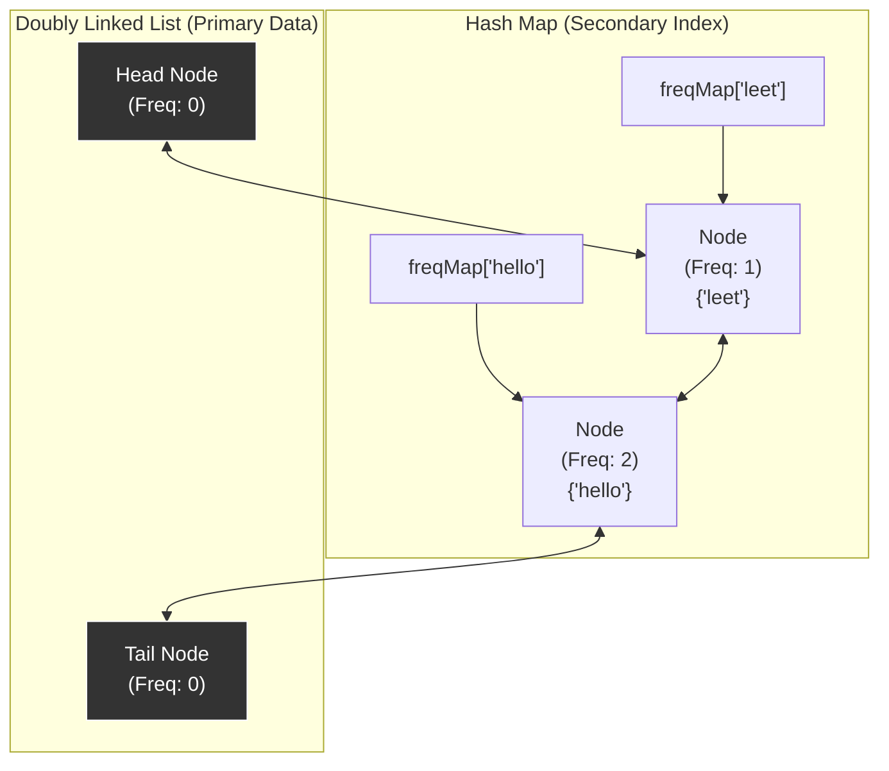

## 432. All O`one Data Structure
LeetCode Link: https://leetcode.com/problems/all-oone-data-structure/

## The Problem
Design a data structure to store the strings' count with the ability to return the strings with minimum and maximum counts. Every single function (inc, dec, getMaxKey, getMinKey) MUST run in strict $O(1)$ time complexity.

## Architecture: Bucketed Doubly Linked List + Hash Map Index

To achieve strict $O(1)$ time complexity across all operations, we cannot rely on trees (std::set / std::map) or heaps (std::priority_queue) because they introduce $O(\log N)$ factors for insertions, deletions, or updates.

Instead, we use a Bucketed Doubly Linked List.
1. The DLL: Each node represents a specific frequency and contains a std::unordered_set of all strings that currently have that frequency. The list is kept strictly sorted by frequency.
2. The Secondary Index: A std::unordered_map<string, Node*> maps a string directly to its frequency bucket in the DLL, allowing $O(1)$ lookups.


## Approaches

| Approach | `inc` / `dec` Time | `getMin` / `getMax` Time | Why it fails/succeeds |
| :--- | :--- | :--- | :--- |
| **Hash Map + Priority Queue** | Amortized $O(1)$* | Amortized $O(1)$* | *Lazy Deletion*. Finding an item in a heap to update its frequency takes $O(N)$. You must use lazy deletion (zombies), which leads to unpredictable latency spikes. |
| **Hash Map + `std::map` (Tree)** | $O(\log N)$ | $O(1)$ | `std::map` keeps frequencies sorted automatically using a Red-Black Tree, but moving a string between frequency buckets takes $O(\log N)$ time. |
| **Hash Map + DLL (Optimal)** | **Strict $O(1)$** | **Strict $O(1)$** | Perfectly deterministic. We only shift a string to the `prev` or `next` node, which requires only $O(1)$ pointer updates. Memory is managed precisely. |

## C++ Code HM + DLL
```cpp
#include <string>
#include <unordered_map>
#include <unordered_set>

using namespace std;

class Node {
public:
    Node *prev, *next;
    int freq;
    unordered_set<string> cache;
    Node (int f) {
        prev = next = nullptr;
        freq = f;
    }
};

class AllOne {
    unordered_map<string, Node*> freqMap;
    Node *head, *tail;
    
    void addNodeAfter(Node* currNode, Node* newNode) {
        Node* temp = currNode->next;

        currNode->next = newNode;
        newNode->prev = currNode;

        newNode->next = temp;
        temp->prev = newNode;
    }

    void removeNode(Node* tempNode) {
        Node* tempPrev = tempNode->prev;
        Node* tempNext = tempNode->next;

        tempPrev->next = tempNext;
        tempNext->prev = tempPrev;

        delete tempNode;
    }

public:
    AllOne() {
        head = new Node(0);
        tail = new Node(0);
        head->next = tail;
        tail->prev = head;
    }
    
    ~AllOne() {
        // Prevent memory leaks in production environments
        Node* curr = head;
        while (curr != nullptr) {
            Node* nextNode = curr->next;
            delete curr;
            curr = nextNode;
        }
    }
    
    void inc(string key) {
        if (freqMap.find(key) == freqMap.end()) {
            if(head->next->freq != 1) {
                addNodeAfter(head, new Node(1));
            }
            head->next->cache.insert(key);
            freqMap[key] = head->next;
        } else {
            if (freqMap[key]->next == tail || freqMap[key]->next->freq != freqMap[key]->freq + 1) {
                addNodeAfter(freqMap[key], new Node(freqMap[key]->freq + 1));
            }
            freqMap[key]->next->cache.insert(key);
            freqMap[key]->cache.erase(key);

            Node* newNode = freqMap[key]->next;
            if (freqMap[key]->cache.empty()) {
                removeNode(freqMap[key]);
            }

            freqMap[key] = newNode;
        }
    }
    
    void dec(string key) {
        Node* currNode = freqMap[key];
        currNode->cache.erase(key);

        if (currNode->freq == 1) {
            freqMap.erase(key);
        } else {
            if (currNode->prev == head || currNode->prev->freq != currNode->freq -1) {
                addNodeAfter(currNode->prev, new Node(currNode->freq - 1));
            }

            currNode->prev->cache.insert(key);
            freqMap[key] = currNode->prev;
        }

        if(currNode->cache.empty()) {
            removeNode(currNode);
        }
    }
    
    string getMaxKey() {
        if (tail->prev == head) return "";
        return *(tail->prev->cache.begin());
    }
    
    string getMinKey() {
        if (head->next == tail) return "";
        return *(head->next->cache.begin());       
    }
};
```

### Complexity Analysis
- Time Complexity: $O(1)$ for inc, dec, getMaxKey, and getMinKey. Hash map lookups, pointer reassignments, and unordered_set operations all run in constant time.
- Space Complexity: $O(N)$, where $N$ is the number of unique keys. We store each key once in the DLL and once in the Hash Map. The number of DLL nodes is bounded by $N$.

## Real-World Use Case
### LFU Cache Eviction / Real-Time Trending Metrics: 
This exact architecture is used in systems that need to track "Trending Hashtags" or "Least Frequently Used" cache evictions under massive concurrent load. It allows a backend server to aggressively prune dead items (getMinKey) and query viral items (getMaxKey) deterministically without ever halting the system to run a sorting algorithm.
