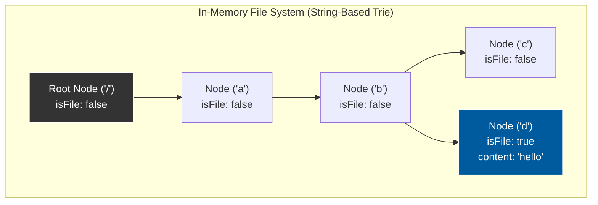

# 588. Design In-Memory File System 
[LeetCode Link](https://leetcode.com/problems/design-in-memory-file-system/)

## The Problem
Design a data structure that simulates an in-memory file system.

Implement the `FileSystem` class:
* `FileSystem()` Initializes the object of the system.
* `vector<string> ls(string path)`
    * If `path` is a file path, returns a list that only contains this file's name.
    * If `path` is a directory path, returns the list of file and directory names **in this directory** in **lexicographic order**.
* `void mkdir(string path)`
    * Makes a new directory according to the given `path`. Creates middle directories if they do not exist.
* `void addContentToFile(string filePath, string content)`
    * If `filePath` does not exist, creates that file containing given `content`.
    * If `filePath` already exists, appends the given `content` to original content.
* `string readContentFromFile(string filePath)`
    * Returns the content in the file at `filePath`.

## Architecture & Approaches

Designing a hierarchical file system requires a tree-like data structure. The optimal choice is a **Trie (Prefix Tree)**, but it must be heavily modified from the standard "dictionary" Trie.

### 1. The Anti-Pattern: Character-Based Trie
A standard Trie uses a 26-character array (`children[26]`) per node. In a file system, this fails critically because it cannot differentiate between the directory `/ab` and the nested directories `/a/b`. Both would create a path `a -> b`. 

### 2. The Optimal Architecture: String-Based Trie
Instead of nodes representing characters, **nodes represent entire directories or files (strings)**.
* We use a `std::map<string, TrieNode*>` for children.
* Why `std::map` instead of `std::unordered_map`? Because `std::map` is a Red-Black tree under the hood. It automatically keeps the keys sorted alphabetically, giving us the $O(1)$ sorting requirement for the `ls()` command entirely for free.
* We must tokenize the input path (e.g., splitting `"/a/b/c"` into `["a", "b", "c"]`) before traversing the tree.

### Comparison of Approaches

| Approach | `ls` Time | `mkdir` Time | Memory Scaling | Why it fails/succeeds |
| :--- | :--- | :--- | :--- | :--- |
| **Flat Hash Map** | $O(N \log N)$ | $O(1)$ | Poor (Duplicate prefix storage) | Fails. Storing full paths as keys makes `ls` extremely slow, as you have to iterate over all keys, filter by prefix, and sort. |
| **Character Trie** | $O(L)$ | $O(L)$ | Terrible | Fails. Cannot safely distinguish between multi-character folder names and nested single-character folders. |
| **String-Based Trie (Optimal)** | **$O(T)$** | **$O(T)$** | Excellent (Hierarchical) | Succeeds. Tokenizing the path allows $O(T)$ traversal (where $T$ is the number of tokens). `std::map` gives free lexicographical sorting. |

## System Diagram


## C++ Implementation
*(Note: Includes path tokenization, `std::map` for automatic sorting, and a destructor to prevent memory leaks).*

```cpp
#include <iostream>
#include <vector>
#include <string>
#include <map>
#include <sstream>

using namespace std;

class TrieNode {
public:
    bool isFile;
    string content;
    // std::map automatically sorts keys lexicographically, optimizing the ls() function
    map<string, TrieNode*> children; 

    TrieNode() {
        isFile = false;
        content = "";
    }
    
    ~TrieNode() {
        for (auto const& [key, val] : children) {
            delete val;
        }
    }
};

class FileSystem {
private:
    TrieNode* root;

    // Helper: Tokenizes "/a/b/c" into ["a", "b", "c"]
    vector<string> splitPath(const string& path) {
        vector<string> tokens;
        stringstream ss(path);
        string token;
        while (getline(ss, token, '/')) {
            if (!token.empty()) {
                tokens.push_back(token);
            }
        }
        return tokens;
    }

public:
    FileSystem() {
        root = new TrieNode();
    }
    
    ~FileSystem() {
        delete root;
    }

    vector<string> ls(string path) {
        vector<string> tokens = splitPath(path);
        TrieNode* curr = root;

        for (const string& token : tokens) {
            if (curr->children.find(token) == curr->children.end()) {
                return {}; 
            }
            curr = curr->children[token];
        }

        // Case 1: If it's a file, return just its name
        if (curr->isFile) {
            return {tokens.back()};
        }

        // Case 2: If it's a directory, return all children (already sorted by std::map)
        vector<string> result;
        for (auto const& [name, node] : curr->children) {
            result.push_back(name);
        }
        return result;
    }

    void mkdir(string path) {
        vector<string> tokens = splitPath(path);
        TrieNode* curr = root;

        for (const string& token : tokens) {
            if (curr->children.find(token) == curr->children.end()) {
                curr->children[token] = new TrieNode();
            }
            curr = curr->children[token];
        }
    }

    void addContentToFile(string filePath, string content) {
        vector<string> tokens = splitPath(filePath);
        TrieNode* curr = root;

        for (const string& token : tokens) {
            if (curr->children.find(token) == curr->children.end()) {
                curr->children[token] = new TrieNode();
            }
            curr = curr->children[token];
        }

        // Real-world Defensive Programming: Check for EISDIR collision
        // if (!curr->isFile && curr->children.size() > 0) throw runtime_error("EISDIR");

        curr->isFile = true;
        curr->content += content;
    }

    string readContentFromFile(string filePath) {
        vector<string> tokens = splitPath(filePath);
        TrieNode* curr = root;

        for (const string& token : tokens) {
            curr = curr->children[token];
        }

        return curr->content;
    }
};
```

## Complexity Analysis
Let $T$ be the number of path components (tokens) and $K$ be the number of entries in the final directory.
* **`ls`:** $O(T + K)$ to traverse the path and collect the children. Sorting is handled continuously during insertion by `std::map`.
* **`mkdir`:** $O(T \log C)$ where $C$ is the number of children at each level (due to `std::map` insertion time).
* **`addContentToFile`:** $O(T \log C + \text{Length of Content})$ to traverse the path and append the string.
* **`readContentFromFile`:** $O(T \log C + \text{Length of Content})$ to traverse the path and return the string.
* **Space Complexity:** $O(\text{Total length of all unique paths} + \text{Total length of all file contents})$. Nodes are only created once for shared prefixes.

## System Design / LLD Use Cases
* **Linux Inodes & VFS:** This structure mirrors the Virtual File System (VFS) layer in Linux, where directories are simply nodes that contain lists of pointers to other nodes (inodes), and files are nodes that contain data blocks.
* **Apache ZooKeeper / Etcd:** Distributed key-value stores use this exact hierarchical namespace to maintain cluster configuration data and state.
* **S3 / Object Storage:** While S3 is fundamentally flat, it simulates a file system using string-prefix filtering. Implementing a virtual directory hierarchy over a flat object store uses similar tokenization and prefix-tree concepts.
