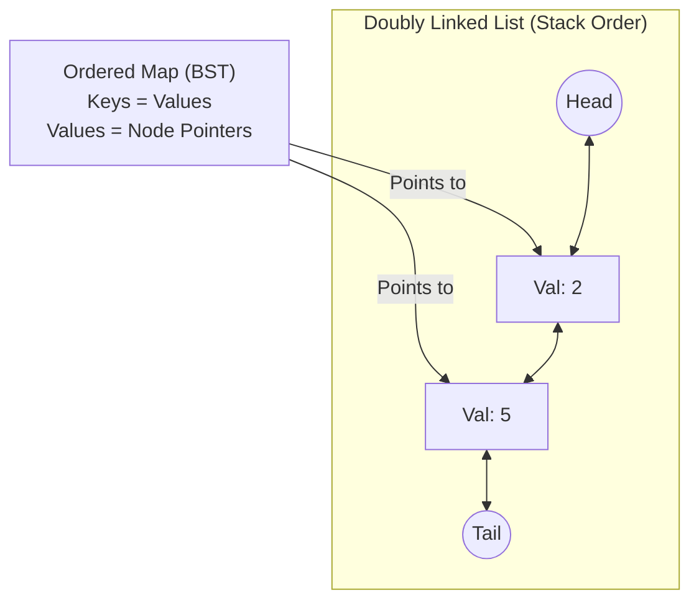

## 716. Max Stack
[https://leetcode.com/problems/max-stack/](https://leetcode.com/problems/max-stack/)

## The Problem
Design a max stack data structure that supports the stack operations and supports finding and removing the maximum element.

### Constraints
* `-10^7 <= x <= 10^7`
* At most `10^4` calls will be made to push, pop, top, peekMax, and popMax.

## 1. Brute Force Idea
Use two stacks. For `popMax()`, pop elements off the main stack and push them into an auxiliary stack until the max element is found, discard it, and push everything back.
* Time Complexity: $O(N)$ for `popMax()`.
* Space Complexity: $O(N)$

This is the "Min Stack" approach adapted for a Max Stack. You maintain the main stack for your actual data and a parallel `max_stack` that keeps track of the maximum value seen up to that specific depth.

* **How it works:** When you push `x`, you push `x` to the main stack. You then push `max(x, max_stack.top())` to the `max_stack`. 
* **The fatal flaw:** `popMax()`. Because you only have access to the top of the stack, to remove the maximum element (which could be at the very bottom), you have to pop elements off one by one, store them in a temporary buffer, discard the max element, and then push the buffer back.

**Time Complexity Breakdown:**
* **`push(x)`:** $O(1)$
* **`top()`:** $O(1)$
* **`peekMax()`:** $O(1)$ (Just look at `max_stack.top()`)
* **`pop()`:** $O(1)$
* **`popMax()`:** **$O(N)$** It works, but an $O(N)$ operation inside a high-throughput system will cause massive latency spikes.


## 2. The "Heap + Stack" with Lazy Deletion
This is the approach most candidates attempt when they realize Two Stacks won't work. Since finding the max in a stack is slow, we introduce a Max-Heap (Priority Queue). 

* **How it works:** We push every element into *both* a Stack and a Max-Heap. To uniquely identify elements (since we can have duplicate values), we assign every pushed element a unique `id`.
* **The trick (Lazy Deletion):** You cannot easily delete a specific element from the middle of a Stack or a C++ `priority_queue`. So, we maintain a `HashSet` of "deleted IDs". 
    * If we call `popMax()`, we pop from the Heap, add its ID to the deleted set, and leave the Stack alone. 
    * If we call `pop()`, we pop from the Stack, add its ID to the deleted set, and leave the Heap alone.
* **The cleanup:** Before we return a value for `top()` or `peekMax()`, we must write a `while` loop that checks if the item at the top of the Stack (or Heap) is in the "deleted set". If it is, we discard it and check the next one.

**Time Complexity Breakdown:**
* **`push(x)`:** $O(\log N)$ (Heap insertion)
* **`top()`:** Amortized $O(1)$
* **`peekMax()`:** Amortized $O(1)$
* **`pop()`:** Amortized $O(\log N)$
* **`popMax()`:** Amortized $O(\log N)$

**The Verdict:** This is an acceptable L4 (Mid-level) answer, but it is deeply flawed in production. Because deletion is "lazy," zombie nodes pile up in memory. If you push 10,000 items and call `pop()` 9,999 times, your Heap still holds 10,000 items, wasting massive amounts of RAM.

```cpp
#include<iostream>
#include<vector>
#include<unordered_set>
#include<stack>
#include<queue>

using namespace std;

class MaxStack {
private:
  stack<pair<int, uint64_t>> main_st;
  priority_queue<pair<int, uint64_t>, vector<pair<int, uint64_t>>> max_st;
  unordered_set<uint64_t> removed; 
  uint64_t uuid = 0;

public:
  void push(int value) {
    main_st.push({value, uuid});
    max_st.push({value, uuid});
    uuid++;
  }

  int peek() {
    while (!main_st.empty() && removed.find(main_st.top().second)!= removed.end()) {
      removed.erase(main_st.top().second);
      main_st.pop();
    }

    if (main_st.empty()) return -1;
    return main_st.top().first;
  }

  int peekMax() {
    while (!max_st.empty() && removed.find(max_st.top().second)!= removed.end()) {
      removed.erase(max_st.top().second);
      max_st.pop();
    }

    if(max_st.empty()) return -1;
    return max_st.top().first;
  }

  int pop() {
    if(main_st.empty()) return -1;

    int value = peek();
    if (value == -1) return -1;

    removed.insert(main_st.top().second);
    main_st.pop();

    return value;
  }

  int popMax() {
    if(max_st.empty()) return -1;

    int maxValue = peekMax();
    if (maxValue == -1) return -1;

    removed.insert(max_st.top().second); 
    max_st.pop();

    return maxValue;
  }
};
```

## 3. The Optimal Architecture: Ordered Map + DLL
This is the approach we implemented. Instead of relying on lazy cleanup, we physically connect the chronological order (the Stack) to the sorted order (the Map) using memory pointers. 

* **How it works:** We build a Doubly Linked List (DLL). Pushing adds to the tail. Popping removes from the tail. To find the maximums, we use an Ordered Map (`std::map` in C++, which is a Red-Black Tree). The keys are the integer values, and the values are `vector<Node*>` pointing directly to the DLL.
* **The magic of `popMax()`:** We ask the Map for the highest key. We grab the pointer to that node. Because it is a DLL, we use that pointer to snip the node out of the middle of the list in exactly $O(1)$ time, and then erase it from the Map in $O(\log N)$ time. Memory is freed instantly.

**Time Complexity Breakdown:**
* **`push(x)`:** $O(\log N)$ (Map insertion)
* **`top()`:** $O(1)$ (Look at DLL tail)
* **`peekMax()`:** $O(1)$ (Look at Map's largest key)
* **`pop()`:** $O(\log N)$ (Must erase from the Map)
* **`popMax()`:** $O(\log N)$ (Must erase from the Map)

**The Verdict:** This is the Senior answer. While `pop()` degraded from $O(1)$ to $O(\log N)$, we completely eliminated the $O(N)$ worst-case scenario and entirely solved the memory-leak issues of Lazy Deletion. Performance is strictly bounded and highly predictable.

### Optimal Approach (Custom Node)
```cpp
#include <map>
#include <vector>

using namespace std;

struct Node {
    int val;
    Node* prev;
    Node* next;
    Node(int v) : val(v), prev(nullptr), next(nullptr) {}
};

class MaxStack {
private:
    Node* head;
    Node* tail;
    map<int, vector<Node*>> bst;

    void removeNode(Node* node) {
        node->prev->next = node->next;
        node->next->prev = node->prev;
    }

    void appendNode(Node* node) {
        node->prev = tail->prev;
        node->next = tail;
        tail->prev->next = node;
        tail->prev = node;
    }

public:
    MaxStack() {
        head = new Node(0);
        tail = new Node(0);
        head->next = tail;
        tail->prev = head;
    }

    void push(int x) {
        Node* newNode = new Node(x);
        appendNode(newNode);
        bst[x].push_back(newNode); 
    }

    int pop() {
        Node* topNode = tail->prev;
        int val = topNode->val;

        removeNode(topNode);

        bst[val].pop_back();
        if (bst[val].empty()) {
            bst.erase(val);
        }

        delete topNode; 
        return val;
    }

    int top() {
        return tail->prev->val;
    }

    int peekMax() {
        return bst.rbegin()->first;
    }

    int popMax() {
        int maxVal = bst.rbegin()->first;
        Node* maxNode = bst[maxVal].back();

        removeNode(maxNode);

        bst[maxVal].pop_back();
        if (bst[maxVal].empty()) {
            bst.erase(maxVal);
        }

        delete maxNode;
        return maxVal;
    }
};
```


* Optimal Time Complexity: $O(\log N)$ for `push`, `pop`, and `popMax`. $O(1)$ for `top` and `peekMax`.
* Optimal Space Complexity: $O(N)$

### System Design / Real-Life Impact
**Caching Infrastructures:** This is identical to the underlying architecture of an LRU (Least Recently Used) or LFU (Least Frequently Used) Cache. Relying on raw pointers bridges the gap between disparate data structures, allowing high-performance storage engines (like Redis or Memcached) to handle complex eviction policies in near constant time.
